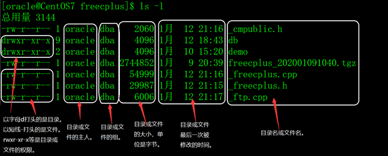

## 一、Linux认知

### 1、重点

&emsp;&emsp;关于怎么使用Linux命令及其附加命令 例： -a  、-l  等等

&emsp;&emsp;①✨`whatis ___`✨  ： 简要概述。<span style="background-color: red;">注意</span>：使用whatis目录前要先检查更新，即

root权限下，使用makewhatis手动更新（OS7版本以下），使用mandb进行更新（OS7

及其以上）

> 例： `whatis ls`、`whatis cd`  、`whatis pwd`、等等

&emsp;&emsp;②`help ___`  ： 详细概述

### 2、自动补全快捷键

&emsp;&emsp;table键

### 3、其他

① **$**&emsp;表示普通用户，#表示root用户(即：管理员身份)

② *****&emsp; 表示所有

例： `*.txt`

③ **^** &emsp;表示以什么开头

④`clean`&emsp; 清屏操作

⑤ 文件权限

> r ：可读read 
>
> w ：可写write
>
> x ：可执行excuse

⑥ `tree`&emsp;显示目录结构


## 二、切换目录、查看、查找、返回命令💖

### 1、切换目录

&emsp;&emsp;cd <folder_name> 切换到某一目录下。例`cd ./test.txt`、`cd ~/` 、`cd ./*.txt`等等

> 特殊：
>
> &emsp;&emsp;`cd ` 切换到home目录
>
> &emsp;&emsp;`cd .. ` 切换到上一级目录
>
> &emsp;&emsp;`cd - ` 返回上次使用的目录
>
> cd home

&emsp;&emsp; . . /表示同一等级目录；   . /表示当前目录  ；    <span style="background-color: yellow;">~/</span> 表示 <span style="color: red;">home目录</span> （即：~/    与    /home/lencamo/  等效）； <span style="background-color: yellow;">/</span> 表示 <span style="color: red;">根目录</span>。

<br>

### 2、查看位置

&emsp;&emsp;①`ls`&emsp;只是**简单**的列出<u>当前目录</u>下的所以文件的文件名。例：`ls / `表示列出根目录

> 列出文件🎉**详细**信息（文件权限、**创建时间**/日期等等）
>
> &emsp;&emsp;ls -l &emsp;乱序排列列出所有文件
>
> &emsp;&emsp;ls -lt &emsp;按时间排列列出所有文件
>
> &emsp;&emsp;ls -l  <file_name> &emsp;某个文件



<br>

&emsp;&emsp;②`ls -a`&emsp;只是**简单**的列出<u>当前目录</u>下的所以文件的文件名（包括隐藏文件，即 . 开头的文件）

> 列出文件🎉**详细**信息（文件权限、**创建时间**/日期等等）
>
> &emsp;&emsp;ll 或者 ls -la&emsp;&emsp;详细的列出所以的文件(包括. 开头的隐藏)

<br>

&emsp;&emsp;③`pwd`   列出当前所处的文件目录位置

### 3、查看内容

&emsp;&emsp;cat   查看文件内容   、  合并文件

> cat first.txt
>
> cat hello.txt world.txt >helloworld.txt

<br>

`more <file_name>`  分页查看文件内容（按空格键显示下一页，按b键显上一页，按q键退出）。

<br/>

`cat -n <file_name>`  查看第n行的文件内容

`head -n <file_name>`    查看前n行的文件内容

`tail -n <file_name>`   查看后n行的文件内容


### 4、查找命令

`find <file_name>`  查找文件夹/文件

`grep <search_content> <search_file_name>`  查找内容

`whereis ___`   查找文件所在目录   /     which 命令的文件位置


## 三、新建、复制、粘贴命令💖

### 1、新建

mkdir   创建<span style="background-color: pink;">文件夹</span>

touch   创建<span style="background-color: yellow;">文件 </span>、 更新访问时间

echo    创建带有内容的文件、打印内容

> 例：echo "hello world! my friend." >first.txt

### 2、删除

rmdir 删除空文件夹


rm  删除<span style="background-color: yellow;">文件</span>（带y/n 确认提示）

rm -r  递归删除/删除<span style="background-color: pink;">文件夹</span>（带y/n 确认提示） 


rm -f   强制删除（文件）（**不带**y/n 确认提示）

rm -rf   强制递归删除（文件夹）（**不带**y/n 确认提示）

### 3、复制

cp&emsp;拷贝<span style="background-color: yellow;">文件</span>

cp -r &emsp; 拷贝<span style="background-color: pink;">文件夹</span>


### 4、剪切、重命名

mv 移动或者重命名(剪切到当前文件夹)  / 剪切 文件或文件夹

> mv a.txt <要移动的目录v>
>
> mv a.txt b.txt     


## 四、文本编辑

### 1、vi

`vi  <file_name>`

> 使用时： 按i键表示进入编辑模式，按ESC键表示退出编辑模式，:wq

### 2、echo

`echo <content_massage> >> <file_name>`  在文件内容后面继续加入一些content_massage

`echo <content_massage> > <file_name>`    覆盖文件中的内容

## 五、压缩、解压、创建快捷方式

&emsp;&emsp;-z：打包同时压缩✨

>  **-c**：产生.tar 打包文件
>
>  **-x**：解压.tar文件
>
>  **-t**：查看压缩包内容

&emsp;&emsp;-v：显示详细信息verbose

&emsp;&emsp;-f：指定压缩后的文件名file

### 1、tar

> 解压、压缩  .tar.gz 的文件 

**打包压缩的语法**：

tar <span style="color: red;">z<span style="color: green;">c</span>vf </span><压缩包文件名>  [要放的地方]

**解包解压的语法**：

tar <span style="color: red;">z<span style="color: green;">x</span>vf</span> <压缩包文件名>  [要放的地方]

**查看压缩包内容：**

tar <span style="color: red;"><span style="color: green;">t</span>f</span> <压缩包文件名> 

<br>

### 2、.zip

```javascript
解压：unzip FileName.zip
压缩：zip FileName.zip DirName
```

### 3、.rar

```javascript
解压：rar x FileName.rar
压缩：rar a FileName.rar DirName
```

### 4、软链接（快捷方式）

`ln <file_name>  <file_name>` &emsp;创建软链接


## 六、关机、重启、注销

reboot   重启

init 6

<br>

halt  关机

init 0

<br>

logout 注销

## 七、网络、性能、系统信息、内存

ifconfig   查看网络信息（ip地址）

ping 测试网络连通

<br>

top 任务管理器

kill -s name/pid   杀死进程 

<br>

df -h -T 查看磁盘内存情况

<br>

chkconfig --list 列出系统服务

service <服务名>  status/start/stop/restart   服务状态、启动/终止/重启服务

systemctl status/start/stop/restart <服务名>     服务状态、启动/终止/重启服务

systemctl enable <服务名>   开启开机自启动

systemctl disable <服务名>   关闭开机自启动

<br>

date  查看时间

cal   查看日历

netstat  显示网络状态信息


## 八、友链

> &emsp;&emsp;[相关文档](https://www.freecplus.net/94103ae45b9048a7a60b6aca31f57a41.html)

