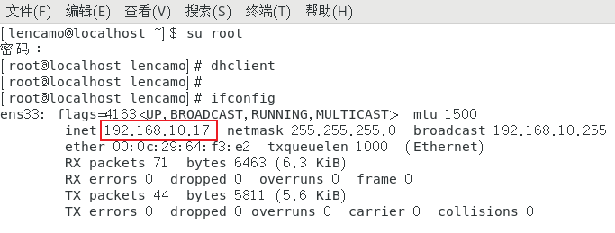

&emsp;&emsp;关于下载：

> ①vmware安装：(https://www.vmware.com/) 
>
> ②Linux镜像节点：[清华开源镜像站](https://mirrors.tuna.tsinghua.edu.cn/)  、 [网易开源镜像站](https://mirrors.163.com/)

&emsp;&emsp;💖VMware搭建Linux节点：

> 下面演示时使用的是桥接模式，从而搭建出一个在局域网中相对独立的Linux操作系统。

 

## 一、如何获得自己电脑的ip（WiFi的ip）

### 1、通过cmd命令查看

`ipconfig`

### 2、直接点击WLAN查看

&emsp;&emsp;&emsp;&emsp;得到：

 

## 二、搭建Linux节点

&emsp;&emsp;首先要安装VMware、Centos，安装过程自行解决（我常用自定义安装）。但安装过程要特别注意下面两点：

①模式要选择 **桥接模式**

②root密码设置要牢记（后面要设置的用户和密码为开机密码）

### 1、自动为Centos配置一个静态ip

&emsp;&emsp;在安装好的Centos中鼠标右键——>打开终端；然后进行下面的操作

**①切换到root模式**

`su root`

**②获得一个静态ip**

`dhclient`

`ifconfig `

> 显然：
>
> 宿主机局域网ip（自己连接的WiFi地址)：192.168.10.13
>
> Centos配置的静态ip：192.68.10.17
>
> 👀在同一网段。所以：✨如果更换WiFi，局域网的网段可能不是**10**，则需要另外打造一个节点✨。所以，打造多节点环境是非常必要的。

**③配置静态ip网卡**

`vim /etc/sysconfig/network-scripts/ifcfg-ens33`

i    （进入编辑模式：开始编辑ifcfg-ens33文件）

> 关于DNS服务器设置，我上面用的是国内腾讯云旗下的Public DNS+的免费DNS解析服务：119.29.29.29
>
> 当然国外也有许多免费的DNS解析服务，比如：谷歌的Google Public DNS：8.8.8.8
>
> 更多内容可以参考：https://www.techug.com/post/free-dns-server-ip-list.html

按下Esc键   （退出编辑模式）

:wq         （安全退出）

 

`systemctl restart network.service`    （重启服务）

**④与宿主机互通**（当然各个节点之间也可以互通）

`ping 192.168.10.13`     （宿主机ip）

`ping www.baidu.com`

> 用数据参数，即为成功联网。

 

## 三、结束语

&emsp;&emsp;更多学习笔记可以查看我的《web服务器》做的学习笔记：

**&emsp;&emsp;重点信息：**

> ①没有设置root用户，默认用户名为root
>
> ②root密码
>
> ③搭建的Centos节点地址192.168.10.17

 

## 三、可能遇到的问题

#### 1、鼠标移动不顺畅

#### 2、等等

 

## 四、友链

> 学习视频：https://www.bilibili.com/video/BV1bA411b7vs

