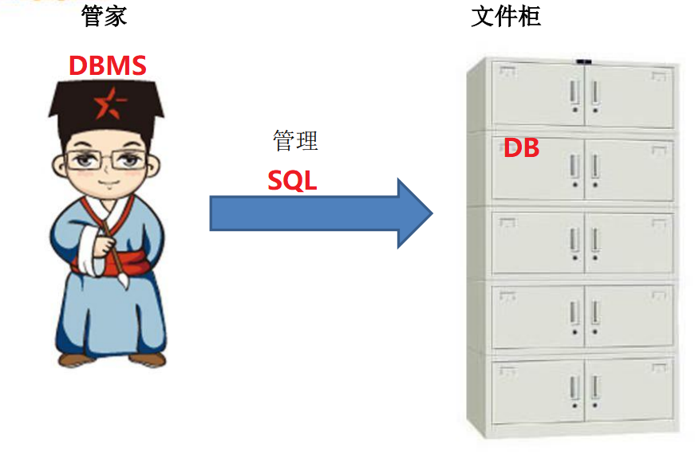
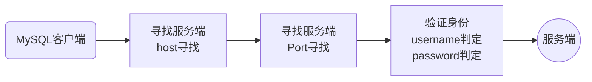
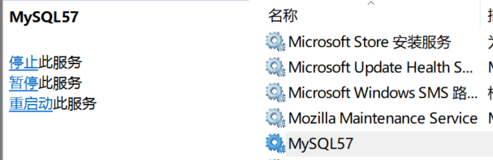

## 数据库相关概念：
### **1、DBMS、SQL、DB**

### **2、记录、字段**

|  行  |  列  |                  |
| :--: | :--: | :--------------: |
| 记录 | 字段 |    （数据库）    |
| 元组 | 属性 | （关系型数据库） |
| row  | col  |                  |

### **3、常见的==关系型==DBMS**

MySQL、Oracle、DB2、SQL Server等等

* 大型：Oracle、DB2
* 中型：MySQL、SqlServer
* 小型：Sybase、Access

### **4、关系型数据库**

* **关系型数据库**：是一种建立在关系模型上的数据库
  * 关系模型
    * 关系数据结构（存储）
    * 关系操作集合（操作）
    * 关系完整性约束（约束）
  * 关系型数据库存储在磁盘中（永久性存储）

## 一、MySQL简介

### 1、概念

**MySQL**：是瑞典AB公司下的一款**关系型数据库**

* MySQL当前属于甲骨文公司（AB->Sun->Oracle）
* MySQL开源免费（部分存储引擎）
* MySQL是一种==C/S==结构软件，因此需要MySQL的客户端来访问服务端（数据管理）
  * mysqld.exe：服务端
  * ==mysql.exe：客户端==
  * 上面的程序在默认安装路径中 > C:\Program Files\MySQL\MySQL Server 5.7\bin
* MySQL使用SQL指令对数据库进行操作

### 2、访问原理

* -h：主机地址（本机localhost可以省略）
* -P：端口号（默认3306可以省略）
* -u：用户名
* -p：用户密码

### 3、小结

1、MySQL需要通过客户端来进行服务端访问

* 自带客户端mysql.exe：Windows下借助CMD
* 数据库管理工具：Navicat，图形化管理
* 支持MySQL扩展的编程语言：PHP、Java等

2、MySQL是一种C/S结构的软件，所以访问者必须通过客户端进行访问

* 客户端与服务端通常不会在一台电脑上
* 客户端访问服务端需要寻址、授权（-hPup）
* MySQL服务端的连接数是有限的，时刻注意用完就销毁（减少资源无效占用）

## 二、在CMD控制台中使用mysql（自带客户端）

### 1、查看mysql版本
`mysql --version`
或
`mysql -V`

### 2、启动/关闭mysql服务🤔
①命令行方式
`net start mysql服务名`

`net stop mysql服务名`

②手动方式（推荐✨）
> 此电脑右击 --> 管理(G) --> 服务和应用程序 --> 服务 -->找到MySQL服务

（这种方式即可以直观的进行mysql服务操作，还可以看到mysql服务名）

### 3、mysql服务名
&emsp;&emsp;以我的mysql服务为例，我下载的是mysql 5.7版本，所以安装时默认的mysql服务名为：MySQL57。
&emsp;&emsp;查看mysql服务名：如上图所示。

### 4、登录/退出mysql服务
> 默认user(-u)为 root ，password(-p)在安装mysql时已经设置。 

`mysql -u root -p<密码>`

（相当于： mysql.exe -hlocalhost -p3306 -uroot -p<密码>）

`exit`   或者  `/q`  或者   `quit`

## 三、在mysql客户端中使用(推荐：✨)
&emsp;&emsp;常用的有Navicat、SQLyog等等。
（使用mysql客户端不仅可以直接查看、新建数据库/表等等，还可以连接多个mysql服务。

### 略

## 四、在cmd中基本的mysql命令
根据操作不同，分为几类

* DQL：Data Query Language，数据查询语言，用于查询和检索数据
* DML：Data Manipulation Language，数据操作语言，用于数据的写操作（增删改） 
* DDL：Data Definition Language，数据定义语言，用于创建数据结构
* DCL：Data Control Language，数据控制语言，用于用户权限管理
* TPL：Transaction Process Language，事务处理语言，辅助DML进行事务操作（因此也归属于DML）   

