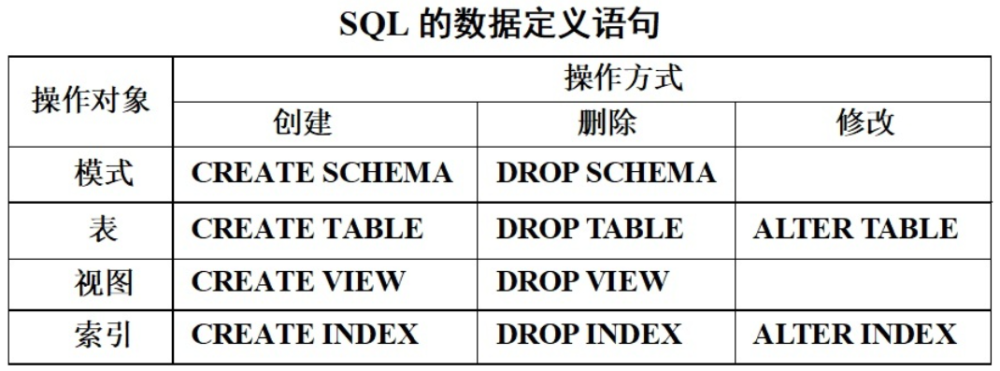

/1505726-e03e2775199cec3b.png)

> 说明:
>

### 💖[] 

表示可以选择使用

### db_n、t_n

表示数据库名、表名

### create

创建

### alter

修改

### drop

删除


## 一、数据==库==操作

> 显示数据库：
>
> ```mysql
> show datebases;
> 
> -- 显示创建的SQL语句
> show create database db_1;	
> ```
> 使用数据库：
>
> ```mysql
> use db_1;
> ```


### 1、创建

```mysql
create database [if not exists] db_1 [charset utf8MB4] [collate utf8mb4_general_ci];

#常见的使用
create database if not exists db_1

-- 由于刚安装的mysql默认编码为latin1,
-- 在cmd客户端创建数据库时最好要最加charset gbk
create database if not exists db_1 charset gbk✨
```

### 2、修改*
```mysql
#①修改库名
/*
	数据库名字不可修改（老版本可以）
		* 先新增
		* 后迁移
		* 最后删除
*/

#②修改库选项
-- 字符集
alter database db_2 charset gbk;

-- 校对集
alter database db_3 charset gbk collate gbk_chinese_ci;

```


### 3、删除

```mysql
drop database db_1;
```


## 二、SQL==表==(字段)操作

> 1、表创建时需要指定存储的数据库
>
> * 明确指定数据库：`数据库.表名`✨
> * 先使用数据库：`use 数据库名字`
>
> 
>
> 2、表可以指定表选项（都有默认值）
>
> * 存储引擎：engine [=] 具体存储引擎
> * 字符集：[default] charset 具体字符集（继承数据库）
> * 校对集：collate（继承数据库）


> 显示SQL表：
>
> ```mysql
> show tables;
> 
> -- 显示指定数据库的表
> show tables from db_3;
> -- 显示创建的表的SQL语句✨ 💖
> show create tables t_3[/G]
> ```
>
> 查看SQL表(结构✨)
>
> ```mysql
> desc t_1;
> /*
> 	该语句与 describe 表名; show columns from 表名;是一样的效果
> */
> ```
>
> 

### 1、创建

```mysql
create table [数据库名.]表名(
	字段名 字段类型,
	...
    字段名 字段类型
)表选项;

#创建方式一
use db_2;
create table t_2(
    name varchar(50),
    age int,
    gender varchar(10)
)[engine Innodb] [charset utf8MB4];

#创建方式二
create table db_2.t_2(
    name varchar(50),
    age int,
    gender varchar(10)
)[engine Innodb] [charset utf8MB4];


#创建一个与已有表一样的数据表
-- MySQL提供了一种便捷的复制模式
create table 表名 like 数据库名字.表名
```

### 2、修改

**更改字段**：指针对表创建好后，里面字段的增删改

* 字段操作包含字段名字、类型和属性的操作

* 字段操作分为四类

  * 新增字段：add [column]
  * 更改字段名：change 
    * 字段名更改通常只是修改字段名字，但是也<span style="color: red">必须跟随说明类型</span>

  * 修改类型：modify
  * 删除字段：drop
    * 字段删除在删除字段名的同时会删除<span style="color: red">字段对应的数据</span>，而且不可逆

* 字段操作还有位置处理

* 字段操作通常是在表已经存在数据后进行

* 

```mysql
#①修改表名
rename table t_1 to t1;

#②修改表选项
-- 字符集
alter table t1 charset utf8;

#③更改字段💖
##alter + add :增加
alter table 表名 add [column] 字段名 字段类型 [字段属性] [字段位置]
--
alter table t_3 add id int [first];
alter table t_3 add card varchar(18) [after name];

##alter + change :改字段名
alter table 表名 change 原字段名 新字段名 字段类型 [字段属性] [位置]
--
alter table t_3 change card sfz varchar(18);

##alter + modify :改字段类型
alter table 表名 modify 字段名 字段类型 [字段属性] [位置]；
--
alter table t_3 modify sfz char(18) [after id];

##alter + drop :删除字段
alter table 表名 drop 字段名;
--
alter table t_3 drop age;
```


### 3、删除

```mysql
drop table t_1;
```


## 拓展：

存储引擎是指数据存储和管理的方式

MySQL中提供了多种存储引擎，一般使用默认存储引擎

* InnoDB
  * 默认存储引擎
  * 支持事务处理和外键
  * 数据统一管理
* MyIsam
  * 不支持事务和外键
  * 数据、表结构、索引独立管理
  * MySQL5.6以后不再维护

## 三、常见的数据类型

## 四、常见的约束类型
