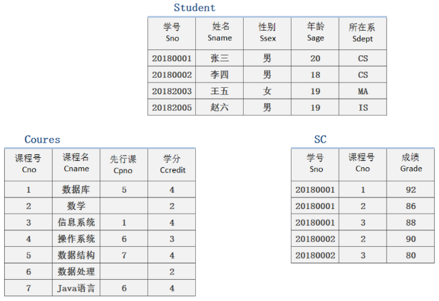

①**字段选择**：根据实际需求选择的要获取数据的字段信息

字段数据可以不一定是来自数据源（select只要有结果即可）

* 数据常量：`select 1`
* 函数或者变量：`select unix_timestamp(),@@version` （@@是系统变量的前缀，后面跟变量名）

②**字段别名**：给字段取的临时名字，通常为了保护数据

字段别名使用as语法实现

* 字段名 as 别名
* 字段名 别名

```mysql
# 获取当前时间戳和版本号
select unix_timestamp() as now,@@version as version,@@version;
```

where筛选的内容因为还没进入内存，所以数据是没有被加工过的

* 字段<span style="color:red;">别名不能在where中使用</span>

③**数据源**：from关键字之后，数据的来源。

* 单表数据源：数据源就是一张表  `from 表名`
* 多表数据源：数据来源是多张表（逗号分隔） `from  表名1,表名2,...表名N`
* 子查询数据源：数据来源是一个查询结果 `from (select 字段列表 from 表名) as 别名`
  * 数据源要求必须是一个`表`
  * <span style="color:red;">如果是查询结果必须给起一个表别名</span>

```mysql
#注意：
-- 多表数据源：利用一张表的一条数据匹配另外一张表的所有记录，记录结果为：记录数 = 表1记录数 * 表2记录数；字段数 = 表1字段数 + 表2字段数（💖笛卡尔积）
select * from t_27,t_30;  /*尽量避免*/

-- 子查询数据源:
/*
	* 查询语句需要使用括号包裹
	* 查询结果需要指定别名
*/
select * from (select * from t_27,t_30) t; # 数据有冲突查不出来
select * from (select * from t_27) as t;
```


## 一、单表查询

```mysql
select id as s
from t_1 as t
where 筛选条件
group by 分组条件
having 分组后筛选
order by 排序条件
limit size;

# limit
-- offset:起始条目索引值(默认为0)
-- size:条目数
/*
limit限制数量的方式有两种
	* limit size
	* limit offset,size  (  分页查询💖: limit (page-1)*size,size  )
*/

```


## 二、多表查询

#### 应用示例：

①不管是大型还是小型项目，一个数据库里都会有N张表，表之间也通过一对一、多对一或者多对多关系进行关联：如新闻管理系统

作者表：id、用户名、密码

新闻表：id、标题、内容、发布时间、作者id

②显示新闻的时候是肯定需要显示作者姓名的

* 原始方式：查出新闻表-->查出作者ID-->查出作者表
* 多表操作：使用连接查询一条SQL搞定


## 1、连接查询

> 本人学习以==sql99==语法为例👀, sql92语法我就不做介绍了。

* 交叉连接（笛卡尔积）
* 自然连接
* 内连接
  * 等值
  * 非等值
  * 自连接

* 外连接
  * 左外连接
  * 右外连接
  * 完全连接（mysql不支持）
* using关键字

#### 图示：


#### ①交叉连接 cross join

**交叉连接**：cross join，不需要连接条件的连接

* 交叉连接产生的结果就是==笛卡尔积==
  * 左表的每一条记录都会与右表的所有记录连接并保留
* 交叉连接没有实际数据价值，只是丰富了连接查询的完整性

```mysql
#交叉连接t_41和t_42表
select * from t_41 cross join t_42;
-- 类似于
select * from t_41,t_42; /*前面讲过*/
```

* 没有条件（没有同名字段）：交叉连接
* 有条件：内连接/外连接（看关键字使用）


#### ②内连接 [inner] join

😁舍弃**悬浮元组**！！

**内连接**：[inner] join，将两张表根据指定的条件连接起来，严格连接

* 内连接是将一张表的每一条记录去另外一张表根据条件匹配
  * 匹配成功：保留连接的数据
  * 匹配失败：都不保留
* 内连接语法： `左表 join 右表 on 连接条件`

建表

```mysql
#学生对专业多对一关系
-- 学生表
create table t_43(
	id int primary key auto_increment,
    name varchar(50) not null,
    course_no int
)charset utf8;
insert into t_43 values(null,'Student1',1),
(null,'Student2',1),
(null,'Student3',2),
(null,'Student4',3),
(null,'Student5',1),
(null,'Student6',default);

-- 专业表
create table t_44(
	id int primary key auto_increment,
    name varchar(50) not null unique
)charset utf8;
insert into t_44 values(null,'Computer'),(null,'Software'),(null,'Network');
```

内连接应用：

```mysql
#获取已经选择了专业的学生信息，包括所选专业
-- 对【字段】取别名
select t_43.*, t_44.name as course_name 
from t_43 inner join t_44 on t_43.course_no = t_44.id;

-- 对【表】起别名✨
select s.*, c.name as c_name 
from t_43 as s inner join t_44 as c on s.course_no = c.id;
```

分类：

```mysql
#根据on后的连接条件，可以对内连接进行分类
-- 不同的表
/*
* 等值 
* 非等值
*/

-- 相同的表(自己与自己)
/* 
自连接
*/
```

#### ③自然连接

> 操作和内连接一样， 
>
> 不同的是 inner join 变为了 natural join

扩展：

自然连接包含自然内连接和自然外连接

* 自然内连接：natural join
* 自然外连接：natural left/right join

自然连接条件匹配模式：<span style="color:red;">自动寻找相同字段名</span>作为连接条件（字段名相同）

```mysql
create table t_45(
	s_id int primary key auto_increment,
    s_name varchar(50) not null,
    c_id int comment '课程id'
)charset utf8;
insert into t_45 select * from t_43;

create table t_46(
    c_id int primary key auto_increment,
    c_name varchar(50) not null unique
)charset utf8;
insert into t_46 select * from t_44;


# 自然连接：条件只有一个相同的c_id
select * from t_45 natural join t_46;
```


#### ④外连接 [outer] join

😄保留**悬浮元组**！！

**外连接**：outer join，是一种不严格的连接方式

* 外连接分为两种
  * 左外连接（左连接）：left join
  * 右外连接（右连接）：right join
* 外连接有主表和从表之分
  * 左连接：左表为主表
  * 右连接：右表为主表
* 外连接是将主表的记录去匹配从表的记录
  * 匹配成功保留
  * 匹配失败（全表）：也保留，只是从表字段置空

```mysql
#左外连接
 -- 查出所有的学生信息，包括所在班级
select s.*,c.name c_name 
from t_43 s left join t_44 c on s.course_no = c.id;
 
 
 #右外连接
 -- 查出所有班级里的所有学生
 select s.*,c.name c_name 
 from t_43 s right join t_44 c on s.course_no = c.id;
```

#### ④自连接



```mysql
# 自连接
/*以Course表为例*/
-- 查询每一门课的间接先修课(即先修课的先修课)
select fist.Cno, second.Cpno
from Course as fist, Course as second
where fist.Cpno = second.Cno;
```

#### using关键字

**using关键字**：连接查询时如果是同名字段作为连接条件，using可以代替on出现（比on更好）

* using是针对同名字段（using(id) === A.id = B.id）
* using关键字使用后会自动合并对应字段为一个
* using可以同时使用多个字段作为条件

```mysql
select s.*,c.c_name 
from t_45 s left join t_46 c using(c_id);

select * 
from t_45 s left join t_46 c using(c_id);
```


## 2、子查询

**子查询**：sub query，通过select查询结果当做另外一条select查询的条件或者数据源

```mysql
/*
想查出某个专业的所有学生信息
	* 查询的目标是学生表
	* 查询的条件在专业表
*/
-- 以前的解决方案（连表查询）
select s.* 
from t_45 s right join t_46 c using(c_id) 
where c.c_name = '专业名字';

-- 现在的解决方案（子查询）
select * 
from t_45 
where c_id = (
    select c_id 
    from t_46 
    where c_name = '专业名字'
);
```

**子查询分类**：根据子查询**出现的位置**或者**产生的数据效果**分类

* 位置分类
  * ==from子查询==：子查询出现在from后做数据源，表子查询
  * ==where子查询==：子查询出现在where后做数据条件
* 按子查询得到的结果分类
  * 标量子查询：子查询返回的结果是一行一列（一个数据）
  * 列子查询：子查询返回的结果是一列多行（一列数据）
  * 行子查询：子查询返回的结果是一行多列
  * 表子查询：子查询返回的结果是一个二维表
  * exists子查询：子查询返回的结果是布尔结果（验证型）
* 子查询都需要使用括号 `()` 进行包裹，必要时需要对子查询结果进行<span style="color:red;">别名处理（from子查询）</span>

#### ①标量子查询🎉where

```mysql
-- 获取Computer专业的所有学生
# 数据目标：学生表t_45
# 条件：专业名字，不在t_45中，但是t_45中的专业id可以通过专业名字在另外一张表精确获得（一个值）
select * 
from t_45 
where c_id = (
    select c_id 
    from t_46 
    where c_name = 'Computer'
);

#其中：
/*
	select c_id 
    from t_46 
    where c_name = 'Computer';
    的结果为✨ 【一行一列】
*/
```


#### ②列子查询🎉where

```mysql
-- 获取所有有学生的班级信息
# 数据获取目标是班级信息
# 数据获取条件是在学生表中的班级id，是多个
select * 
from t_46 
where c_id in (
    select distinct c_id 
    from t_45 
    where c_id is not null
);

#其中：
/*
	select distinct c_id 
    from t_45 
    where c_id is not null;
    的结果为✨ 【一列多行】
*/
```


#### ③行子查询where

**行子查询**：子查询返回的结果是一行多列

* 行子查询需要条件中构造行元素（多个字段组成查询匹配条件）
  * <span style="color:red;">(元素1,元素2,..元素N)</span>
* 行子查询通常也是用来作为主查询的结果条件

```mysql
-- 获取学生表中性别和年龄都与弥勒相同的学生信息
# 查询条件有多个：性别和年龄
# 数据的条件的来源在另外一张表中

-- 以前的解决方案（多个标量子查询）
select * 
from t_40 
where gender = (   /*效率低*/
    select gender 
    from t_42 
    where name = '弥勒'
) 
and age = (
    select age 
    from t_42 
    where name = '弥勒'
);

-- 现在的解决方案（行子查询）
# 构建条件行元素(gender,age)
select * 
from t_40 
where (gender,age) = (
    select gender,age 
    from t_42 
    where name = '弥勒'
);

#其中：
/*
	select gender,age 
    from t_42 
    where name = '弥勒'
    的结果为✨ 【一行多列】
*/
```


#### ④表子查询from🤔

**表子查询**：子查询返回的结果是多行多列（二维表）

1、表子查询出现的业务

* 一条select指令中所用到的<span style="color:red;">子句顺序✨不能满足查询条件</span>
* 数据的来源可能是多张数据表
* 表子查询<span style="color:red;">多出现在from之后当做数据源</span>（from子查询）

2、特别注意：在MySQL7以后，子查询中使用的order by子句需要配合limit才会生效

```mysql
-- 获取学生表中每个班级里年龄最大的学生信息（姓名、年龄、班级名字），然后按年龄降序排序显示

-- 传统的解决方案
select any_value(name),max(age) m_age,class_name 
from t_42 
group by class_name 
order by m_age desc;
/*结果发现：
	1、name any_value取的是分组后的第一条记录数据
	2、age  max取得的最大的记录数据
   【    从而name与age并没有✨相互匹配     】	
*/

-- 现在的解决方案（表子查询）
/*
问题：order by必须在group by之前解决（否则会出现与传统的解决方案一样的问题）,
	 但group by语句又必须在order by之前
*/
select any_value(name),max(age) m_age,class_name 
from (
    select name,age,class_name   
    from t_42 
    order by age desc  /*即：先对t-42表进行降序排序*/
    limit 99999
) as t                 /*from子查询必须要 💖 取别名*/
group by class_name 
order by m_age;

#其中：
/*
	select name,age,class_name   /*即：先对t-42表进行降序排序*/
    from t_42 
    order by age desc  
    limit 99999
    的结果为✨ 【多行多列】
*/
```


#### ⑤exists子查询🎉where

```mysql
-- 获取所有有学生的班级信息t_46

/*即：判断*/

# 获取的数据是班级表t_46
# 班级是否有学生需要在t_45中确认，并不需要t_45提供任何数据显示
select * 
from t_46 c 
where exists(  
    select c_id   /*exists子查询中尽量少💖的选择字段（不建议使用*），因为都是无价值的*/
    from t_45 
    where c.c_id = c_id
);
```


#### 延展：比较（in、some、ang）

**比较方式**：在子查询中可以使用一些特定的比较方式

* 特定的比较方式都是基于比较符号一起使用
* all：满足后面全部条件
  * \> all(结果集)：数据要大于结果集中的全部数据
* any：满足任意条件
  * \= any(结果集)：数据只要与结果集中的任何一个元素相等
* some：满足任意条件（与any完全一样）
* 结果集：可以是直接的数据也可以是子查询结果（通常是列子查询）

```mysql
-- 找出t_40表中与t_42表中年龄相同的信息

# 数据获取在t_40表
# 数据条件在t_42表

# 解决方案1：使用in列子查询
select * 
from t_40 
where age in (
    select distinct age 
    from t_42
);

# 解决方案2：使用exists子查询
select * 
from t_40 t1 
where exists(
    select id 
    from t_42 
    where t1.age = age
);

# 解决方案3：使用any或者some匹配（列子查询）
select * 
from t_40 
where age = some(
    select age from t_42
);
```

#### 总结：

1、子查询通常使用较多的是标量子查询、列子查询和exists子查询

2、<span style="color:red;">子查询的效率💖是比连接查询的效率要低的</span>，要适当选择使用


## 3、联合查询

1、union是负责将多次查询的==结果统一拼凑显示==

* 记录数增加
* 字段数不变（第一条SQL指令决定）

2、union常用方式

* 因为数据量大分表存储，然后统一查看或者统计
* 根据不同维度对数据进行筛选，然后统一查看或者统计

3、union<span style="color:red;">默认是(distinct)去重的</span>，想要保留全部查询结果，需要使用union all

```mysql
#1、默认去重
select * from t_40
union 
select * from t_40;

#2、手动设置为不用去重
select * from t_40
union all
select * from t_40;
```

#### 联合查询排序

**联合查询排序**：针对联合查询的结果进行排序

* order by本身是对内存结果进行排序，union的优先级高于order by，所以order by默认是对union结果进行排序
* 如果想要对单独select的结果进行排序，需要两个步骤
  * 将需要排序的select指令进行括号包裹（括号里使用order by）
  * order by必须✨配合limit才能生效（limit一个足够大的数值即可）

```mysql
#order by使用
-- 对联合后进行排序
select * from t_40
union all
select * from t_42
order by age desc; 

-- 对联合前进行排序
/*
注意点:
	① 加（）
	② 必须配合💖limit使用
*/
(select * from t_40 order by age desc limit 99999)
union 
(select * from t_42 order by age desc limit 99999);
```

