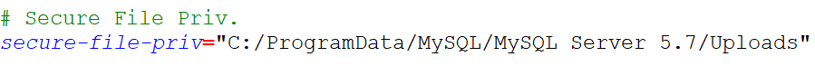

## 一、外键约束

### 1、创建外键

**外键**：foreign key，表中指**向外部表主键**的字段定义成外键

* 外键必须要通过语法指定才能称之为外键
  * ==[constraint`外键名`] foreign key(当前表字段名) references 外部表(主键字段)==
* 外键构成条件✨
  * 外键字段必须与对应表的主键字段类型、长度、字符集、引擎一致
  * 外键字段本身要求是一个索引（创建外键会自动生成一个索引）

```mysql
#创建专业表和学生表，学生表中的专业id指向专业表id
create table t_1(
	id int primary key auto_increment,
    name varchar(50) not null unique
)charset utf8;

create table t_49(
	id int primary key auto_increment,
    name varchar(50) not null,
    c_id int,
    foreign key(c_id) references t_47(id)
    /*
    	外键可以不指定名字，系统会自动生成
    constraint `c_id` foreign key(c_id) references t_47(id)
    */
)charset utf8;

#查看外键名字constraint、外键索引名key
show create table t_2;
```

### 2、外键约束

**外键约束控制**：外键可以在定义时控制外键的约束作用

* 控制类型
  * on update：父表更新时子表的表现
  * on delete：父表删除时子表的表现
* 控制方式
  * cascade：级联操作，父表操作后子表跟随操作
  * set null：置空操作，父表操作后，子表关联的外键字段置空
  * restrict：严格模式，不允许父表操作（默认的）
  * no action：子表不管

①注意事项：

```mysql
-- 1、子表不能插入主表不存在的数据

-- 2、默认的外键产生后，主键不能更新被关联的主键字段或者删除被关联的主键记录

-- 3、子表可以插入外键为Null的数据
```

②外键约束：

限制外键约束，一般使用更新级联，删除置空

* on update cascade：更新级联
* on delete set null：删除置空

```mysql
create table t_50(
	id int primary key auto_increment,
    name varchar(50) not null unique
)charset utf8;

create table t_51(
	id int primary key auto_increment,
    name varchar(50) not null,
    c_id int, # 如果要允许置空，就不能not null
    foreign key(c_id) references t_50(id) on update cascade on delete set null
)charset utf8;

insert into t_50 values(null,'Chinese'),(null,'Computer');
insert into t_51 values(null,'Tony',1),(null,'Petter',2);
```

### 3、外键管理

```mysql
#新增外键
-- alter table 表名 add [constraint `外建名`] foreign key(外键字段) references 表名(主键) [on 外键约束]
alter table t_51 add constraint `t_51_50` foreign key(c_id) references t_50(id);

#删除外键
-- alter table 表名 drop foreign key 外键名;
alter table t_51 drop foreign key t_51_ibfk_1;	# 系统生成的外键
```


## 二、事务安全

#### 应用场景：转账

①MySQL中默认的写操作是直接写入的

* 执行写操作SQL
* **同步到数据表**

（可以发现，对应转账的实际应用场景，它并不安全）

②使用事务

在操作前告知系统，接下来所有的操作都暂**不同步到数据表**，而是记录到**事务日志**，指导后续所有操作都成功，再进行同步；否则取消所有操作

### 1、事务处理

**事务处理**：利用自动或者手动方式实现事务管理

* 自动事务处理：系统默认，操作结束直接同步到数据表（事务关闭状态）
  * 系统控制：变量 autocommit（值为ON，自动提交）
* ==手动事务处理==
  * 开启事务： `start transaction`
  * 关闭事务
    * 提交事务：`commit`（同步到数据表同时清空日志数据）
    * 回滚事务：`rollback`（清空日志数据）
* 事务回滚：在长事务执行中，可以在某个已经成功的节点处设置回滚点，后续回滚的话可以回到某个成功点
  * 设置回滚点：`savepoint 回滚点名字`
  * 回滚到回滚点：`rollback to 回滚点名字`

#### ①手动事务处理

```mysql
# 手动事务：启用事务转账，成功提交事务
-- 开启事务
start transaction;

-- Tom扣钱
update t_52 set account = account - 1000 where id  = 1;

-- Lucy收钱
update t_52 set account = account + 1000 where id  = 2;

-- 提交事务
commit;
```

#### ②事务回滚

如果因工作人员操作失误，Lucy的钱加多了？

```mysql
# 开启事务
start transaction;

# Tom扣钱
update t_52 set account = account - 1000 where id= 1;

# 设置回滚点
savepoint sp1;

# Lucy收钱
update t_52 set account = account + 10000 where id= 2;

# 操作失败回到回滚点
rollback to sp1;

# Lucy收钱
update t_52 set account = account + 1000 where id= 2;

# 提交事务
commit;
```

#### ③设置默认事务模式

```mysql
show variables like 'autocommit';

set autocommit = 0;	
```

### 2、事务的特点

**事务特点**：事务处理具有ACID四大特性

* 原子性（Atomicity ）：一个事务操作是一个整体，不可拆分，要么都成功，要么都失败
* 一致性（Consistency）：事务执行之前和执行之后都必须处于一致性状态，数据的完整性没有被破坏（事务逻辑的准确性）
* 隔离性（Isolation ）：事务操作过程中，其他事务不可见
* 持久性（Durability ）：事务一旦提交，结果不可改变

### 3、事务锁、脏读

* **事务锁**：当一个事务开启时，另外一个事务是不能对当前事务锁占用的数据进行操作的
  * 行锁：当前事务只占用了一行（id精确检索数据），那么其他事务可以操作其他行数据
  * 表锁：当前事务占用了整张表（like扫码整个表），那么其他事务对整张表都不能操作
* **脏读**：一个事务在对某个数据进行操作但尚未提交，而另外一个事务读到了这个“历史”数据其实已经被修改

#### 重点：

扩展：事务处理的支持是有条件的

* 存储引擎需要为==InnoDB==

## 三、预处理

要执行的SQL指令想使用预处理

* <span style="color:red">减少重复执行</span>的指令
* 涉及数据安全的指令（<span style="color:red">防止SQL注入</span>的安全问题）

### 1、预处理

```mysql
#查询学生的SQL指令需要重复执行很多次

-- 传统的查询操作
select * from t_42;
select * from t_42;
select * from t_42;


-- 使用预处理操作
# 预处理操作：发送预处理
prepare p1 from 'select * from t_42';

# 预处理操作：执行预处理
execute p1;
execute p1;
execute p1;

# 删除预处理
deallocate  prepare p1;
```

### 2、预处理传参💖

**预处理传参**：在执行预处理的时候传入预处理需要的==可变数据==

```mysql
# 准备预处理：涉及参数
prepare t_40_insert from 'insert into t_40 values(null,?,?,?,?)';

# 设置变量并传入参数
set @name = '药师兜';
set @gender = '男';
set @age = 23;
set @class_name = '木叶1班';

# 执行预处理
execute t_40_insert using @name,@gender,@age,@class_name;

# 删除预处理
deallocate  prepare t_40_insert;
```


## 四、视图

**视图**：view，一种由select指令组成的**虚拟表**

* 视图是虚拟表，可以使用表管理（结构管理）
  * 为视图提供数据的表叫做基表
* ==视图有结构，但不存储数据==✨
  * 结构：创造视图时，select选择的字段
  * 数据：来源于访问视图时执行的select指令

### 1、视图的创建与使用

```mysql
# 创建视图
create view 视图名字 as select指令;

# 访问视图：一般都是查询
select */字段名 from 视图名字;
```

```mysql
#有些复杂的SQL又是经常用到的，如多张表的连表操作：可以利用视图实现
-- 院系表
create table t_53(
	id int primary key auto_increment,
    name varchar(50) not null
)charset utf8;
insert into t_53 values(null,'语言系'),(null,'考古系');

-- 专业表
create table t_54(
    id int primary key auto_increment,
    name varchar(50) not null,
    s_id int not null comment '学院id'
)charset utf8;
insert into t_54 values(null,'English',1),(null,'Chinese',1);

-- 学生表
create table t_55(
	id int primary key auto_increment,
    name varchar(50) not null,
    s_id int not null comment '专业Id'
)charset utf8;
insert into t_55 values(null,'Lilei',2),(null,'Mark',2),(null,'Tony',1);

#获取所有学生的明细信息
-- 方式一：传统方法
select stu.*,sub.name as sub_name,sub.s_id as sch_id,sch.name as sch_name 
from t_55 as stu left join t_54 sub on stu.s_id = sub.id left join t_53 sch on sub.s_id = sch.id;

-- 方式二：以视图保存这类复杂指令，后续可以直接访问视图
create view v_student_detail 
as 
select stu.*,sub.name as sub_name,sub.s_id as sch_id,sch.name as sch_name from t_55 as stu left join t_54 sub on stu.s_id = sub.id left join t_53 sch on sub.s_id = sch.id;

select * from v_student_detail;
```

### 2、视图管理

```mysql
#1、查看视图
show tables;	# 查看全部视图
show create table/view 视图名字;	# 查看视图创建指令
desc 视图名字;	 # 查看视图结构

#2、更改视图
alter view 视图名 as 新的查询指令;
create or replace view 视图名 as 新的查询指令;	# 创建新的或者替换新的

#3、删除视图
drop view 视图名; 
```

### 3、视图的数据操作

①数据操作有条件

视图操作条件

* 多基表视图：不允许操作（增删改都不行）
* 单基表视图：允许增删改
  * 新增条件：视图的字段必须包含基表中所有不允许为空的字段
* with check option：操作检查规则
  * 默认不需要这个规则（创建视图时指定）：视图操作只要满足前面上述条件即可
  * 增加此规则：视图的数据操作后，必须要保证该视图还能把通过视图操作的数据查出来（否则失败）

②数据操作的语句

同普通的表操作一样

③视图数据操作一般情况下是不允许的，通常之所以对外提供视图就提供数据的只读操作

### 4、视图算法

视图算法一共有三种

* undefined：默认的，未定义算法，即系统自动选择算法
* ==merge==：合并算法，就是将视图外部查询语句跟视图内部select语句合并后执行，<span style="color:red">效率高</span>（系统优先选择）
* ==temptable==：临时表算法，即系统将视图的select语句查出来先✨得出一张临时表，然后外部再查询，<span style="color:red">安全</span>（temptable算法视图不允许写操作）

```mysql
# 默认算法：algorithm = undefined
create algorithm = undefined view v_student_4 as select * from t_42 order by age desc;

# 合并算法：algorithm = merg
create algorithm = merge view v_student_5 as select * from t_42 order by age desc;

# 临时表是否：algorithm = temptable
create algorithm = temptable view v_student_6 as select * from t_42 order by age desc;
```

一般在设计视图的时候要考虑到视图算法的可行性，通常视图中如果出现了order by排序的话，就要考虑使用temptable算法

* 只要merge以后，不会导致数据因为子句的先后顺序而混乱（order by与group by的顺序混乱容易出问题）


## 五、数据备份与还原*

**备份**：backup，将数据或者结构按照一定的格式存储到另外一个文件中，以保障阶段数据的完整性和安全性

* 将当前正确数据进行数据保存
* 备份通常是有固定的时间节点

**还原**：restore，在当前数据出问题的情况下，将之前备份的数据替换掉当前数据，保证系统的持续、正确的运行

* 基于备份进行数据还原
* 备份还原不一定能够保证所有损失挽回

### 1、表数据

#### 备份

* 字段格式化：fields
  * terminated by：字段数据结束✨后使用的符号，默认是空格
  * enclosed by：字段数据包裹，默认什么都没有
  * escaped by：特殊字符的处理，默认是转义
* 行格式化：lines
  * terminated by：行结束符号，默认是\n，自动换行
  * starting by：行开始✨符号，默认没有

```mysql
/*
	select 字段列表|*  into outfile 外部文件路径 
		[fields terminated by 格式 enclosed by 格式]
		[lines terminated by 格式 starting by 格式]
	from 数据表;
*/

-- 默认方式
select * into outfile  'D:/t_40.csv' from t_40;

-- 自定义:
select name,gender,age,class_name into outfile 'D:/t_40_self.csv'
	fields terminated by '-' enclosed by '"'
	lines starting by 'GO:'
from t_40;

/*
报错与权限secure-file-priv问题：
	在（my.ini）中配置好这个配置项：secure-file-priv = 数据导入导出路径/不指定值
	（重启MySQL生效）
*/
```



#### 还原

```mysql
/*
	load data infile '数据文件所在路径' into table 表名
		[fields terminated by 格式 enclosed by 格式]
		[lines terminated by 格式 starting by 格式]
		[(字段列表)];	# 如果是部分表字段，那么必须将字段列表放到最后
*/

#将t_40.csv数据导入到db_3数据库中的一个与t_40表结构一致的表中
create table t_40 like db_2.t_40;

-- 默认：
load data infile 'D:/t_40.csv' into table t_40; # 有可能因为字符集出现问题           
load data infile 'D:/t_40.csv' into table t_40 charset utf8; 

-- 自定义：
load data infile 'D:/t_40_self.csv' into table t_40 charset utf8 
	fields terminated by '-' enclosed by '"' 
	lines starting by 'GO:' (name,gender,age,class_name) ;
```

### 2、文件*

不推荐

①MyIsam表的文件备份：找到三个文件，复制迁移

* sdi：表结构文件
* MYI：索引文件
* MYD：数据文件

②InnoDB表的文件备份：找到两个文件，复制迁移

* ibd：表结构文件
* ibdata：所有InnoDB数据文件

### 3、SQL💖

#### 备份

**利用bin文件的Mysqldump.exe客户端实现备份**

1、全库备份（借助于Windows下的cmd访问mysqldump.exe，当前用户使用root账号）

`mysqldump.exe -uroot -proot --all-databases > D:/mysql.sql`


2、单库备份

`mysqldump -uroot -proot --databases db_2 > D:/db_2.sql`


3、单表备份（没有创建数据库的指令）

`mysqldump -uroot -proot db_2 t_40 t_42 > D:/t_40_42.sql`


#### 还原

1、库层面

把 > 换成  <  即可

`mysql.exe -uroot -p db_2 < D:/t_40_42.sql`


2、表层面

```mysql
source D:/t_40_42.sql;
```


## 六、用户管理

### 1、角色管理

**角色**相关操作和语法

* 创建角色：`create role 角色名字1[,角色名字2,...角色名字N]`（可批量创建）
* 分配权限：`grant 权限列表 on 数据库|*.数据表|* to 角色名字`
* 绑定角色：`grant 角色名字 to 用户名@主机地址`
* 撤销角色：`revoke 角色名字 from 用户名@主机地址`
* 回收角色权限：`revoke 权限列表 on 数据库|*.数据表|* from 角色名字`
* 删除角色：`drop role 角色名字1[,角色名字2,...角色名字N]`

**关联角色**

1、创建角色

2、确定角色的权限：给角色分配权限

3、将角色分配给用户（和第2步可以没有先后关系）

4、权限分配者每次登陆服务器时✨激活角色：

- `set default role all  to 用户名@主机地址`（一次只能激活一个角色）

* 激活之后对应的用户需要退出之后重新登录才行

创建：

```mysql
# 创建角色（角色与用户名很相似）
create role developer,app_read,app_write;

# 给角色分配权限
grant all on db_2.* to developer;
grant select on db_2.* to app_read;
grant insert,update,delete on db_2.* to app_write;

# 创建用户，并分配角色给用户
create user 'admin1'@'%' identified by '1234';
create user 'admin2'@'%' identified by '1234';
create user 'admin3'@'%' identified by '1234';

grant developer to 'admin1'@'%';
grant app_read to 'admin2'@'%','admin1'@'%'; # 允许批量给用户分配角色
grant app_write to 'admin3'@'%';
```

回收：

```mysql
# 回收角色权限
revoke insert,delete on db_2.* from app_write;

# 回收角色
revoke app_read from 'admin2'@'%';

# 删除角色
drop role developer;
```


### 2、权限管理

常用的开发者权限有：

* create、alter、drop：库、表结构操作
* insert、select、update、delete：数据操作
* references：外键权限
* index：索引

账号的管理通常需要配合权限的使用

* 赋权：给账号绑定相应的权限 `grant 权限列表 on 数据库|*.数据表|* to 用户名@主机地址 `
* 回收：将账号已有的权限回收 `revoke 权限列表 on 数据库|*.数据表|* from 用户名@主机地址 `
* 刷新权限：`flush privileges`
* 查看权限：`show grants for 用户名@主机地址`


### 3、账号管理

### 1、账号管理

**账号管理**：根据项目的需求设置和管理账号

* 账号是权限依赖的对象，先有账号才有权限
* MySQL中账号的组成分为两个部分：用户名 @ 主机地址（root@localhost）
  * 用户名为用户登录时的名字
  * 主机地址：是允许账号所在客户端的访问的客户端IP（如上述root只能在服务器本机通过客户端访问）
* 账号管理
  * 创建账号：`create user 用户名@主机地址 identified by '明文密码';`
  * 删除账号：`drop user 用户名@主机地址`


1、根据项目情况，跟不同的项目组创建不同的账号

```mysql
# A团队只允许在公司访问服务器，公司IP为163.177.151.110
create user `admin`@`163.177.151.110` identified by 'admin123';

# B团队不限定负责数据库管理，不限定工作地点
create user `admin` identified by 'admin321';
```


2、开发任务结束，A团队的任务已经完成，不需要进行数据库操作

```mysql
drop user `admin`@`163.177.151.110`;
```