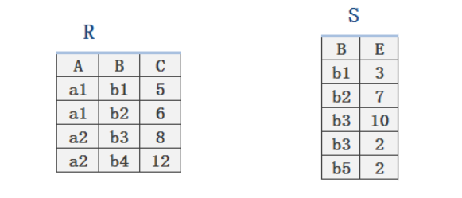
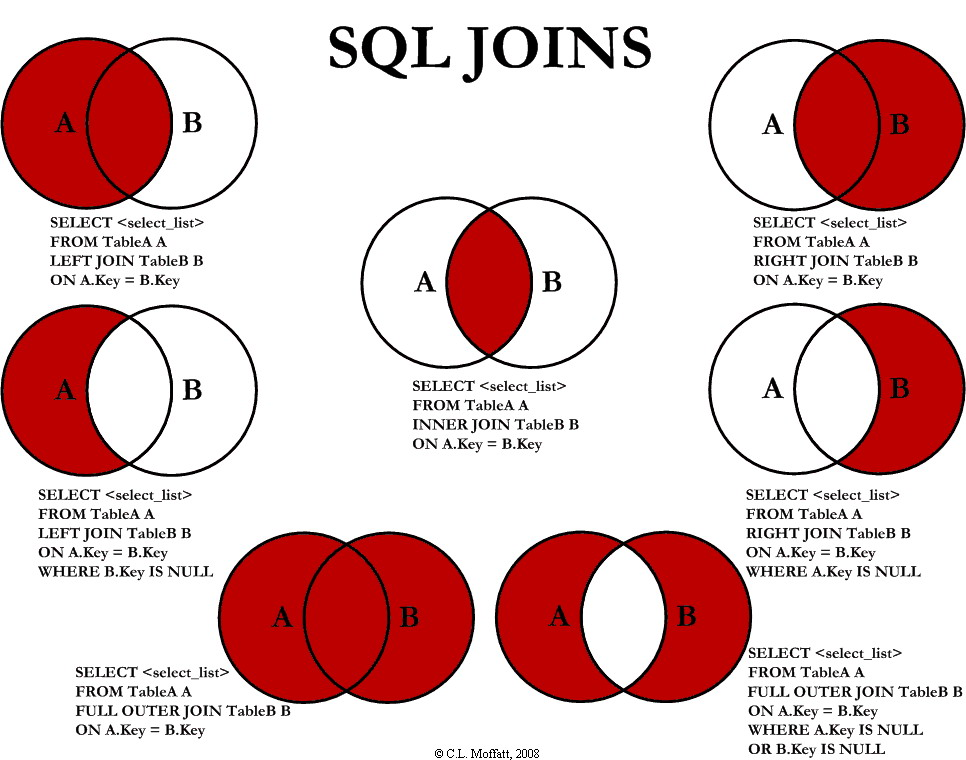

## 一、传统的集合运算

> 前提：
>
> &emsp;&emsp;关系R 和 关系S 具有相同的==属性个数==。

### 1、并 ∪

> R∪S={t|t∈R∨t∈S}


### 2、差 −

> R−S={t|t∈R∨t∉S}


### 3、交 ∩

> R∩S={t|t∈R∧t∈S}


### 4、笛卡尔积 ×

（n * m)

> R×S={t|t=<(tn,tm)∧tn∈R∧tm∈S}


## 二、专门的关系运算

> 选择σ、投影 π 关系运算、自连接
>
> 均用Student、Coures、SC 表来演示
>
> ```mysql
> # 自连接
> /*以Course表为例*/
> -- 查询每一门课的间接先修课(即先修课的先修课)
> select fist.Cno, second.Cpno
> from Coures as fist, Coures as second
> where fist.Cpno = second.Cno;
> ```


### 1、选择σ

> 目的：
>
> &emsp;&emsp;选出满足条件的 ==诸元组==    **∧    ∨     ¬**


```mysql
# 【选择σ】 不改变属性列个数 因此用 select *
-- 比较运算符的SQL表示
select  * 
from Student 
where Sage < 20;
/*延展： [10,20]  -->  where Sage between 10 and 20; */

-- 逻辑运算符的SQL表示
 ¬   not
∧   and
∨   or
```

>  例：σ~Sage<20~ (Student) 


### 2、投影 π

> 目的：
>
> &emsp;选出满足条件的若干 ==属性列==

```mysql
select Sname,Sdept  
from Student;
```

> π~Sname,Sdept~ (Student) 


### 3、连接 θ  💖 ⋈

> 目的：
>
> &emsp;&emsp;从两个关系R、S的==笛卡尔积==中选取 属性间满足一定条件的元组


#### ①关系表



#### ②连接运算

1、内连接


2、自然连接


3、外连接


#### ③SQL语句

1、**using关键字**：连接查询时如果是同名字段作为连接条件，using可以代替on出现（比on更好）

* using是针对同名字段（using(id) === A.id = B.id）
* using关键字使用后会<span style="color:red;">自动合并对应字段为==一个==</span>
* using可以同时使用多个字段作为条件

2、**自然连接**：包含自然内连接和自然外连接

* 自然内连接：`natural join`
* 自然外连接：`natural left/right join`
* 自然连接条件匹配模式：<span style="color:red;">自动寻找相同字段名</span>作为连接条件（字段名相同）

```mysql
#交叉连接
select *
from r2 cross join s2;
/*类似于：
select *
from r2, s2;
*/

-- -------------------------------

#内连接
-- 非等值连接
/*
select *
from r2, s2
where r2.C < s2.E;
*/
select *
from r2 inner join s2 on r2.C < s2.E;

-- 等值连接
/*
select *
from r2,s2
where r2.B = s2.B;
*/
select *
from r2 inner join s2 on r2.B = s2.B;

-- -------------------------------

#自然连接
select *
from r2 natural join s2;
/*类似于使用using：  
select *
from r2 inner join s2 using(B);
*/

-- -------------------------------

#外连接
-- 左外连接
/*
select *
from r2 left join s2 on r2.B = s2.B;
或者；
select *
from r2 natural left join s2;
*/
select *
from r2 left join s2 using(B);

-- 右外连接
/*
select *
from r2 right join s2 on r2.B = s2.B;
或者：
select *
from r2 natural right join s2;
*/
select *
from r2 right join s2 using(B);

```

#### 其他： 

> 自连接内容，详见《5、DQL语言(重点)》

### 4、除 ÷


```mysql
-- 方式1
select A
from r3 natural join s3  
GROUP BY r3.A
HAVING count(r3.A) = (
	SELECT count(*)
	FROM s3 
);

-- 方式2
select A
from r3 left join s3 using(B,C)  /*使用left join 是因为MySQL不支持💖完全外连接*/
GROUP BY r3.A
HAVING count(r3.A) = (
	SELECT count(*)
	FROM s3 
);
```


## 三、配套SQL文件下载

> 本篇文章制作不易，期待你们的小星星😄。
>
> &emsp;&emsp;点击右上角 GitHub 图标即可查看下载 


## 四、SQL JOINS图




