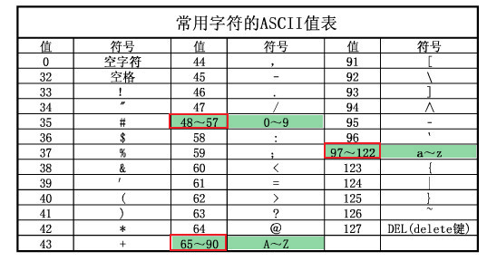
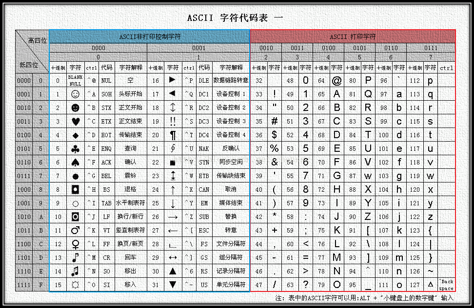
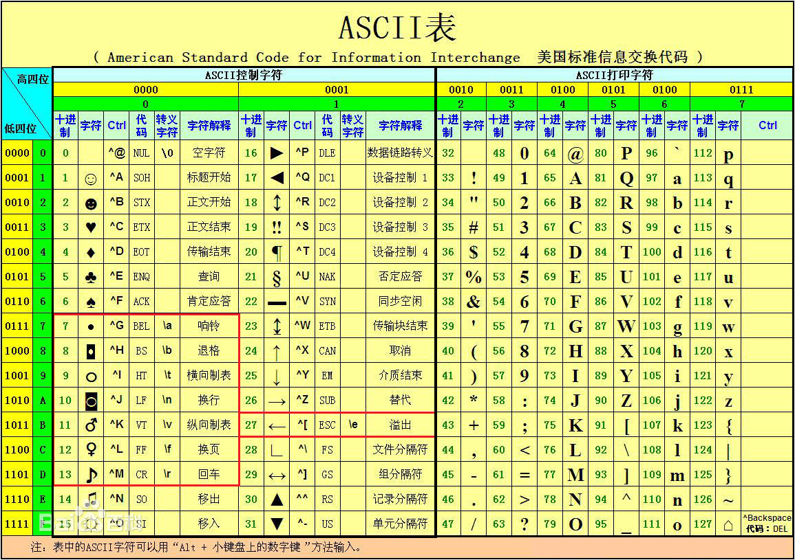
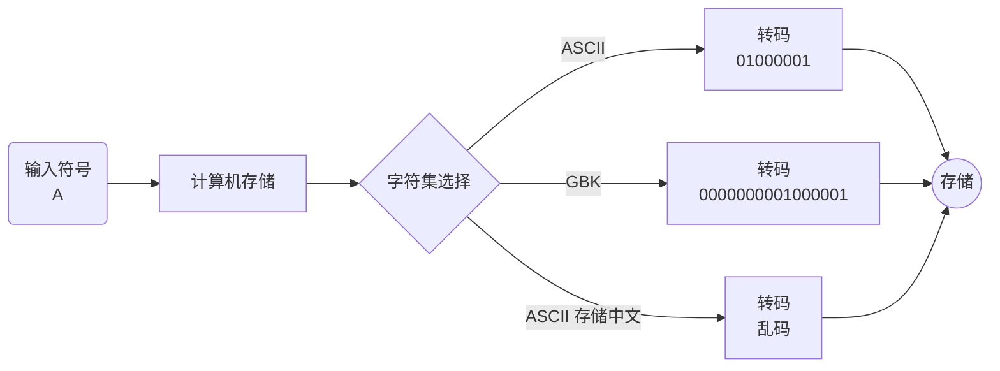
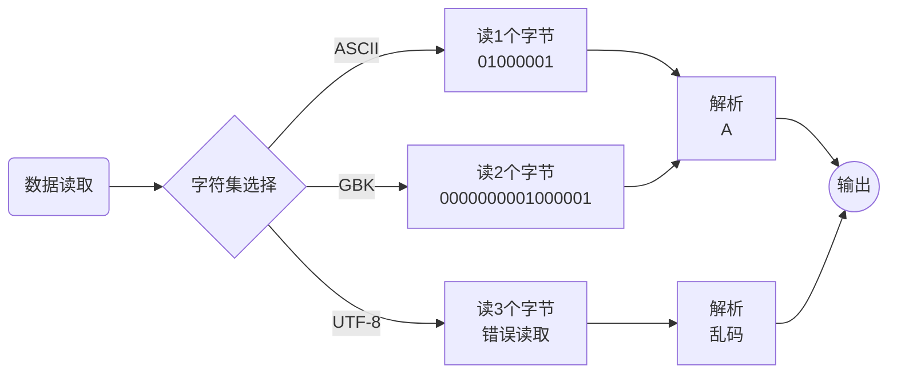
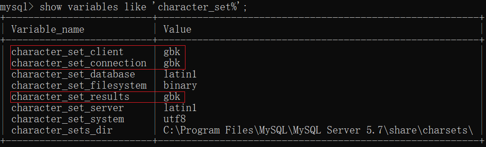
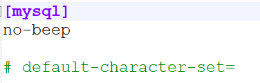
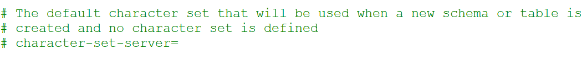

## 一、字符集

**字符集**：charset或者character set，是各种文字和符号在计算机中的总称

* 字符集根据不同国家的符号不同，有不同的字符集
* 不同的字符集占用的存储空间不一样，存储的底层也不一样
* 不同字符集之间可以进行转换
* 常见字符集
  * ASCII：美国信息交换标准码，一般英文符号，一个字节存储
  * latin1：拉丁文字符集，一个字节存储，ISO-8859-1的别名 ，能够向下兼容ASCII
  * GB2312：信息交换用汉字编码字符集 ，是中国1981年的一套国标规范，2个字节存储
  * GBK：汉字内码扩展规范（1995年），两个字节表示表示（汉字很多超过5000个）
  * Unicode：万国码（统一码），使用统一的编码方式来解决传统的局限，1994年出现
  * ==UTF-8==：8-bit Unicode Transformation Format（万国码） ，针对Unicode的可变长度字符编码，采用1-6个字节编码Unicode字符（目前通用编码规则）。建议使用UTF-8字符集进行数据存储（MySQL8中建议使用<span style="color: red;">utf8mb4</span>）



## 二、数据存储、读取





### 1、存储



### 2、读取



## 三、总结

常见的字符集目前是三个

* ASCII：美国信息交换标准码
* GBK：汉字内码扩展规范（国标），<span style="color: red;">兼容ASCII</span>
* UTF-8：8字节万国码，兼容GBK和ASCII

目前基本都统一使用UTF-8开发和数据存储


## 四、MySQL字符集

==set names 客户端字符集;==

**新安装的mysql默认字符集：**



```mysql
#查看mysql支持的所有字符集
show charset; 

#设置客户端字符集
set names gbk; 💖 /*相当于设置了 如上图红色部分的字符编码，优点： 直接统一了编码格式*/
-- 相当于：
set character_set_client = gbk; 
set character_set_results = gbk; 

set character_set_connection = gbk;

/*
1、set names字符集是一种快捷方式，本质有三个变量被修改
	* character_set_client：客户端✨提供给服务端的数据编码
	* character_set_connection：服务端内部连接使用
	* character_set_results：服务端✨提供给客户端的数据编码
2、MySQL服务端提供了变量来记录客户端的字符集
3、MySQL对应的存储字符集的变量可以修改
*/
```


### 1、乱码问题

①乱码的本质原因就是客户端与服务端的字符集不一致导致

②解决乱码问题的方案：保证服务端正确理解客户端的字符集

* set names 客户端字符集
* 在任何数据操作之前（尤其是写数据，包括结构）

### 2、查看、设置字符集

```mysql
#查看系统所有的字符集设置结构
show variables like 'character_set%';

#设置字符集（在使用数据库时，第一时间👀是考虑设置字符集编码格式）
set names 客户端字符集;
```

### 3、重点

乱码是编程中最基础要解决的问题，一旦✨数据产生了乱码，通常是不可逆操作

### 4、如何仿乱码产生

①先在`C:\ProgramData\MySQL\MySQL Server 5.7\my.ini`，对字符集进行设置

- [mysql] 中  
- 
- [mysqld]中
- 
- 设置好后，重启mysql服务

②然后在创建数据库时，首先 输入： `set names gbk;`

③

④

