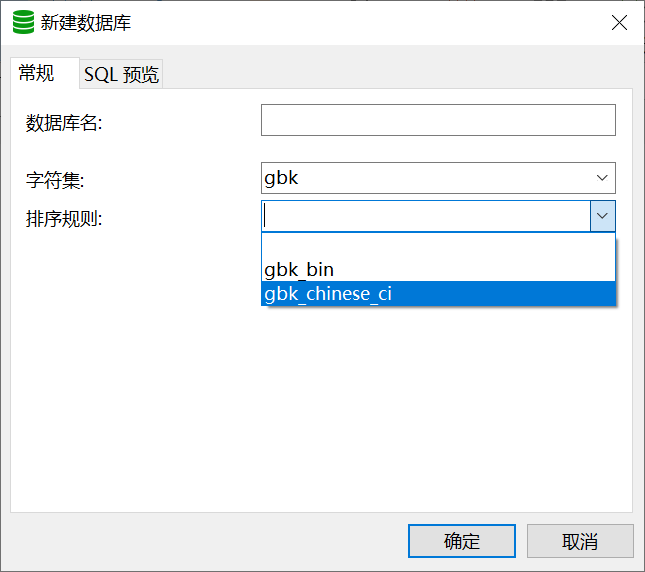

## 一、mysql校对集

### 1、校对集选择

校对规则一共有三种

* ==\_ci==：大小写不敏感，不区分大小写
* \_cs：大小写敏感，区分大小写
* ==\_bin==：二进制比较（区分大小写）

（通常使用的是\_ci、_bin：

```mysql
create database db_4 charset utf8mb4 collate utf8mb4_bin;

/*
MySQL中四层对象都可以设置校对集
	* DBMS：配置文件
	* DB：创建数据库时限定（设置）
	* Table：创建表示限定
	* Field：创建字段时限定
*/
```

**Navicat客户端演示：**



```mysql
/*
	数据表中数据一旦✨产生，校对集的修改就无效
	例：alter table t_5 collate utf8mb4_general_ci;无效
*/
```

