&emsp;&emsp;很早之前就听说做为一个程序员会使用git是非常重要的，于是乎在我在早前就接触并学习了git。

> 其实早期我接触git，纯粹是为了弄一个所谓的github云笔记，也就是草草了事了😂。
>
> 随着个人hexo博客的搭建，以及个人前端小项目的产生，让我对全面学习git的好奇心只增不减（虽然我的小项目根本几乎没有所谓的版本，发布后几乎没怎么改）。

&emsp;&emsp;下面，我来简单介绍一下我对git的一些认知。涉及团队合作啥的复杂git命令我还在建议学习一下git的可视化客户端工具Sourcetree（我的前车之鉴😭，没必要用git命令来`装逼`)。

## 一、仓库与版本

&emsp;&emsp;一个项目的完成，往往会产生很多的版本，而伴随着新版本的产生，项目会变得趋于完善。

### 1、仓库——（特殊的文件夹）

&emsp;&emsp;个人理解，<u>仓库可以想象成一个**特殊的文件夹**</u>，不同的是它可以通过git命令查看自己以前的版本项目。

> 想一想，自己电脑上的文件夹，要么保存修改，要么舍弃，只能二选一；而如果把它搞成一个仓库文件夹，就不用担心这样的事情了，即使你保存了修改，任然可以通过git命令查看修改之前的版本内容。

&emsp;&emsp;类似于软件，有不同的版本。一旦当前要开发时出现有问题，要么在仓库中找到前面的版本进行重新开发升级，要么对当前的版本进行修改。

&emsp;&emsp;仓库就这样，经过一次次的迭代，存放着不同的版本项目。即：<u>仓库以版本为单位进行存储</u>。

### 2、自己的远程/本地仓库间联系

>Remote：远程仓库（例如：自己的GitHub仓库、码云仓库）
>
>Repository：本地仓库（即我所说的特殊的文件夹）
>
>workspace：工作区（即你正在编辑的版本或者当前在特殊文件夹所看到的文件版本）
>
> 
>
>重点：👀
>
>index：缓存区（修改后的项目文件进入仓库前都要经过缓存区）

&emsp;&emsp;不同的状态。

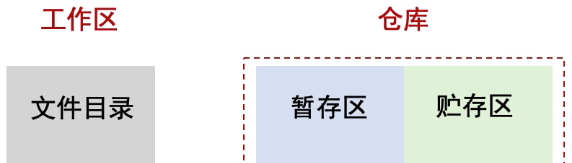

### 2、版本与分支

&emsp;&emsp;git是什么？——一个分布式版本控制工具。涉及团队协作时，版本控制显得尤为重要，不同团队负责不同的分支（branch），最终与master分支合并，形成一个项目版本。

&emsp;&emsp;当然就个人使用来看，基本上一个master分支就可以了。涉及团队协作时，往往设计多个分支（例如：bug修复分支hot_fix、开发者分支dev等等），用Sourcetree可视化客户端比较直观、方便。

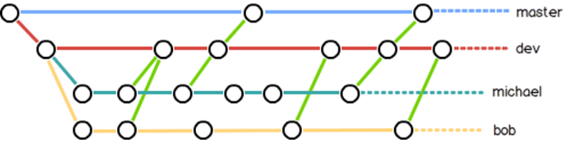

&emsp;&emsp;一个节点对应一个版本，一个仓库（项目）可以有多的分支；反正最后是要与master分支合并的。

## 二、git的安装与基本命令

### 1、[git的安装](https://git-scm.com/)与配置

> git命令在Git Bash Here命令行中进行😎。
>
> 下面我介绍的git命令对于个人使用完全够了，即：只涉及一个master分支

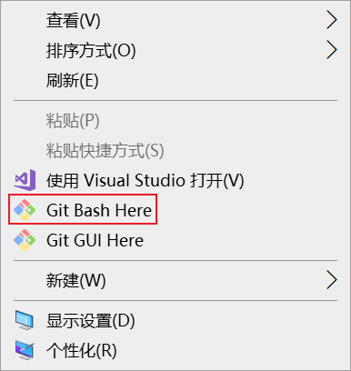

**配置用户信息：**

`git config --global user.name "名字"`

`git config - -global user.email "邮箱地址"`

### 2、git的基础命令

**①git的查看命令：**

`git status`     ✨ 查看项目文件此时的状态（在工作区、缓存区还是在仓库中）

`git config --list `     查看全部的用户信息

`git log`      查看所有的版本信息(例：版本ID、当前处于哪个分支)

`git reflog`        查看所有的操作记录

`git remote -v`       查看远程仓库库地址

`git mv <filename> <new_filename> `        修改项目文件名字

 

**②专有名词：**

master：默认开发分支（最新版本的名字）

origin：给远程仓库地址起别名的常用名字（http方式）

origin_ssh：给远程仓库地址起别名的常用名字（ssh免密方式）

HEAD：当前所在的版本（在分支操作时，也叫没有命名的分支）

HEAD^ ：上一个版本

HEAD~n：前n个版本

③**Linux基本命令**

pwd、mkdir、cd、*.txt 、.   、ls、rm

vim、cat、Ctrl+C、I键 等等

## 三、git的常用命令（个人使用:）

### 1、git的本地操作

#### 1>、创建本地仓库

`git init `     将普通文件夹变成一个仓库文件夹

#### 2>、提交工作区文件

`git add <filename>`       将**单个**项目文件推到缓存区

`git add . `      **所有**项目文件推到缓存区

 

`git commit -m <add a readme file> <filename>`          将**单个**缓存区的项目文件推到本地仓库

`git commit -m <add a readme file> -a`     **所有**缓冲区的项目文件推到本地仓库

> 每一次commit就会生成一个节点，当然一次commit可能提交了多个项目文件，提交多个项目文件时在`<filename> `后面加 `<filename2>`` <filename3>` ……就可以了
>
> 即每发生一次commit就会生成一个版本👀

#### 3>、撤回项目文件（可继续编辑）

①工作区已修改项目文件的撤回

`git checkout -- <filename>`        将**工作区**修改的项目文件撤回到初始状态

> 即Ctrl + Z的升级版：撤销当前版本中修改后已经保存但未commit的项目文件

 

②缓存区中项目文件的撤回

`git reset HEAD -- <filename> `    将**缓存区**的项目文件撤回到工作区

此时回到了①的状态

`git checkout -- <filename>`        将**工作区**修改的项目文件撤回到初始状态

> 上面两个步骤的综合git命令：
>
> `git checkout HEAD -- <filename>`     ✨直接将**缓存区**的项目文件撤回到初始状态
>
> 【延展：`git checkout HEAD . `  这个表示把缓存区所有的项目文件撤回到初始状态   】

 

③本地仓库中项目文件的撤回

> 因为文件已经commit，所有只能<a href="#history">回滚到历史版本</a>

#### 4>、比较项目文件修改前后的区别

①工作区与缓存区的项目文件相比较

`git diff <filename>  `        单个项目文件

`git diff`          所以项目文件

②缓存区与当前版本已提交的项目文件相比较

`git diff HEAD <filename>   ` 

 

③缓存区与本地仓库历史版本的项目文件相比较

`git diff <版本id>  <filename>`

#### 4>、删除已提交的项目文件

①只删除工作区的项目文件

`git rm <delete_filename>    `  

 

②同时删除缓存区的项目文件

先`git rm <delete_filename>    `     

然后 `git add <delete_filename>`

 

③同时删除本地仓库的项目文件

先`git rm <delete_filename> `        

然后 `git add <delete_filename>`

最后 `commit -m <add a readme file> <delete_filename> `

#### 5>、<a id="history">回到历史版本</a>/找回已删除的项目文件（俗称回滚）

`git reset --hard HEAD `  （全部回到当前版本的初始状态）

> 即 这个git命令可以找回<u>工作区、缓冲区已经删除的项目文件</u>

 

`git reset --hard <版本ID>`     （**工作区，缓存区、本地仓库**内容全部后退到历史版本状态） 

> 即 这个git命令可以在历史版本中找到<u>本地仓库已经删除的项目文件</u>

`reset --mixed <版本ID>`        （**缓存区、本地仓库**内容后退到历史版本状态） 

`reset --soft <版本ID>`          （**本地仓库**内容后退到历史版本状态） 

### 2、git的远程操作

#### 1>、本地仓库与远程仓库间的克隆

`git clone <GitHub仓库地址/本地仓库目录>`         将项目克隆一份到新的本地仓库

#### 2>、为自己已创建的远程仓库（GitHub仓库）地址取别名

`git remote add origin <GitHub仓库地址> `  

> 即： `git remote add <仓库a地址别名>  <仓库a的地址>`
>
> 默认别名为 orgin

#### 3>、将本地仓库推送到自己的远程仓库

先  `git remote add origin <GitHub仓库地址>`

// 🙏*git pull  origin master       将远程仓库最新的代码拉到自己的工作区[刷新 ]✨（团队合作时，远程仓库可以会有其他团队成员push了新的项目代码，防止后续自己push时产生冲突）*  

`git push origin master`        将本地仓库推到GitHub远程仓库（origin） 【此处要录入你的GitHub账号和密码】

> 即： git remote add <仓库a地址别名>  <仓库a的地址>

## 三、git分支相关命令（团队使用）

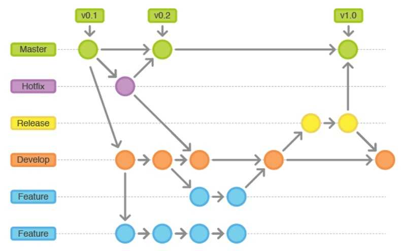

### 1、创建、切换、删除分支

`git branch <分支名>`       创建本地仓库分支

`git checkout <分支名>`       切换本地仓库内的分支 【git checkout **orign/master**     切换到远程仓库的master分支】

`git branch -D <分支名>`     删除本地仓库的分支

 

`git branch -v`       查看所有的分支

`log --oneline --decorate --graph --all`        查看分支结构 

> 一个项目往往有许多模块，在master分支基础上创建不同的分支，让不同的团队去
>
> 开发不同的模块，最后与master分支进行合并，能提高开发效率。

### 2、合并分支

`git merge <要一起合并的分支名X`>       表示当前分支与分支X合并

### 3、合并冲突

&emsp;&emsp;原因：当前分支的某个版本和要合并的分支某个版本，有同一个项目文件，但内容不同。

> 解决方案： 修改存在冲突的项目文件内容即可
>
> ①要么以当前分支的内容为准&emsp；&emsp;②要么以要合并的内容为准&emsp;&emsp;③要么两个都要，去掉重复内容即可

&emsp;&emsp; 然后：

`git add <conflict_filename>`

git commit -m <_add a readme file> 

&emsp;&emsp; 注意，🐱‍👤这里与前面的commit命令不同，commit命令后不用加文件名

### 4、个人所在公司团队间git的远程操作

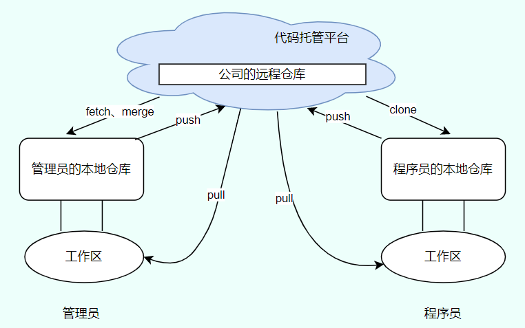

#### 1>自己公司成员间的git基本操作

`git clone <公司项目的远程仓库地址>`         将远程仓库项目克隆一份到自己的本地仓库

 

`git remote add origin <GitHub仓库地址>`       将远程仓库项目地址命名为origin

`git pull  origin master`        将远程仓库项目（origin）拉到个人本地工作区  【相对于管理者的先fetch再margin】

`git push origin master`        将在本地仓库中个人完成的项目内容push到远程仓库（origin）的master分支上✨【此处要录入你的GitHub账号和密码】

> ①前面由于是将个人本地仓库 push 到 自己的GitHub远程仓库，登录自己的GitHub账号是可以成功的。
>
> ②但团队协作时，如果直接push是不会成功的，因为项目的远程仓库往往不是自己建的 ，所以要想push成功，首先要加入 **项目团队**

#### 2>加入项目团队

&emsp;&emsp;首先需要项目仓库创建者（管理者）让你加入团队，并给你发送了邀请地址

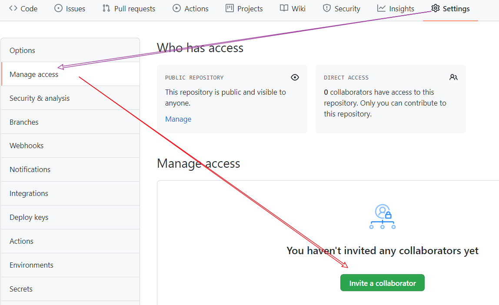

&emsp;&emsp;然后，自己在GitHub上登陆自己的GitHub账号，在上面的网址栏粘贴**邀请地址**，同意后该项目仓库就会显示在你的GitHub里面。

#### 3>相对于项目管理者的git命令

先抓取远程分支的 最新数据到自己的**本地仓库**，但工作区内容仍然没变（<u>并没有和本地仓库合并，还是当前的项目版本</u>）

`git fetch origin master` 

 

然后切换到远程仓库查看 项目内容是否有误

`git checkout origin/master`

cat ……

 

最后确定无误后，才将本地仓库与远程仓库合并，工作区内容也相应改变（<u>此时项目合并后数据更新，产生新的项目版本</u>）

`git margin origin/master`

### 5、跨公司合作git的相关远程操作

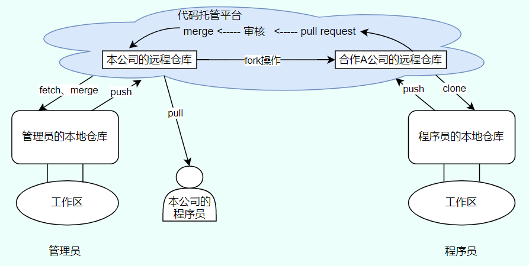

&emsp;&emsp;合作公司A首先要先得到我们公司项目地址，然后fork项目到他们的GitHub中去。

&emsp;&emsp;然后合作公司A自己进行项目优化，完成优化后pull request给我们的公司审核

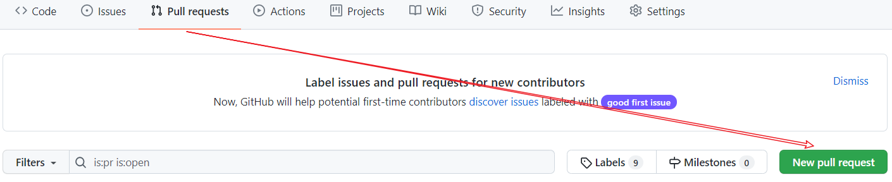

&emsp;&emsp;我们自己的公司通过上图的pull request模块中进行检查、交流后，最后merge pull request通过申请。

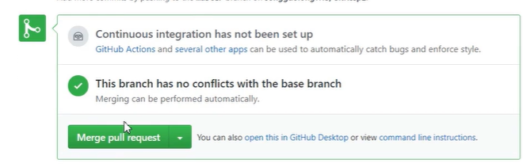

## 四、ssh免密登录(单个账号)

&emsp;&emsp;通过ssh免密操作，当自己将本地仓库push到远程仓库时就不需要密码验证了。

### 1、免密登录实现基础

#### 1>、进入用户主目录

`cd ~`

`pwd`

#### 2>、通过下面的命令即可在用pwd命令得到的目录下建立一个.ssh文件

`ssh-keygen -t rsa -C <个人的GitHub账号邮箱地址>`

`cd ./.ssh`

`ls`

> 通过上面的命令，不仅生成了一个.ssh文件，并且该文件目录下自动生成了id_rsa和id_rsa.pub两个文件

#### 3>、复制id_rsa.pub文件里的全部秘钥内容

在上面代码的基础上，写人下面的命令

`vi id_rsa.pub`

> 通过上面的命令，得到的结果即为 秘钥内容，复制后输入命令：`:wq `即可退出

#### 4>、将秘钥内容与GitHub账号相关联

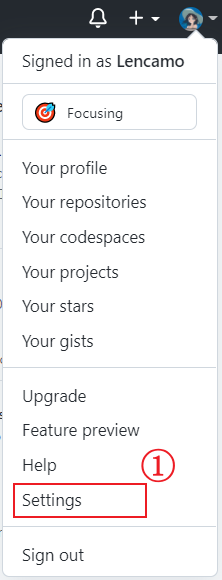

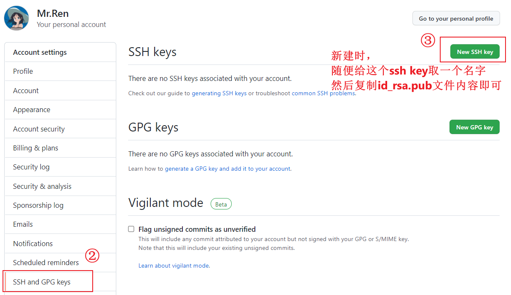

### 2、ssh免密登录方式的使用

#### 1>、为项目仓库地址添加一个ssh地址别名

`git remote add origin_ssh <远程项目仓库的ssh地址>`

`git push origin_ssh master`

> 即：git命令和前面的一样，只是涉及origin时，将origin改为origin_ssh即可

## 五、Sourcetree客户端

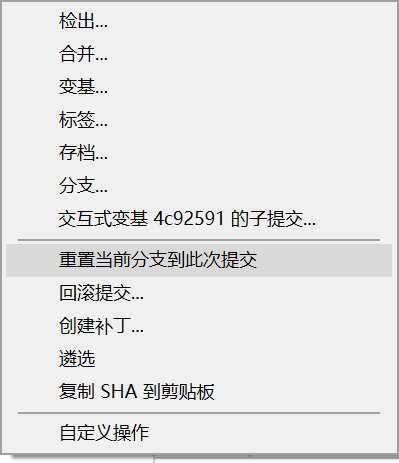

> 注意：  ①使用分支时，不能有未提交文件的分支。

### 1、重置到当前分支到此次提交  

&emsp;&emsp; &emsp;&emsp; ----> 通常选择强制合并

### 2、回滚提交 

&emsp;&emsp; &emsp;&emsp;---->操作自动合并master分支问题

### 3、查看历史版本

&emsp;&emsp; &emsp;&emsp;---->双击即可查看的历史节点（前提：当前没有未提交的修改文件）

### 4、修改历史版本并创建新的分支

&emsp;&emsp; &emsp;&emsp;---->创建新的分支（前提：要给它命名）

### 5、分支合并💖

&emsp;&emsp; &emsp;&emsp;---->最后一定会发生

### 6、合并冲突🤔

&emsp;&emsp; &emsp;&emsp;---->呵呵，我懂就行

 

## 五、友情提示：

​         &emsp;&emsp;[软件、插件下载](https://gitee.com/all-about-git)

​        &emsp;&emsp; [git命令学习文档](https://www.bootcss.com/p/git-guide/)

​         &emsp;&emsp;[Sourcetree学习视频](https://www.bilibili.com/video/BV1qg41177Dd?from=search&seid=1835252203833884066&spm_id_from=333.337.0.0)

​         &emsp;&emsp;[git的学习视频](https://www.bilibili.com/video/BV17o4y1Q7Sx?p=1)

> 更多内容，欢迎🎉🎉光临https://github.com/Lencamo

