### 摘要：

&emsp;&emsp;vm搭建本地服务器通过<NAT模式>搭建Centos节点。在VMware中通过<桥接模式>搭建Centos节点，可以参照我在《Linux学习》做的笔记。

## 一、连接模式的介绍

**①**桥接模式： 

&emsp;&emsp;&emsp;&emsp;通过虚拟机网卡桥接到宿主机网卡上面的方式，从而实现局域网内的上网功能。

> 桥接模式虚拟出来的操作系统，具有单独的ip，就像一台在**局域网**中✨相对独立的主机。

&emsp;&emsp;&emsp;&emsp;**特点**：桥接模式下，<u>通过dhclient命令自动分配</u>的静态ip与宿主机（WiFi)在同一网段：即同一个局域网中。

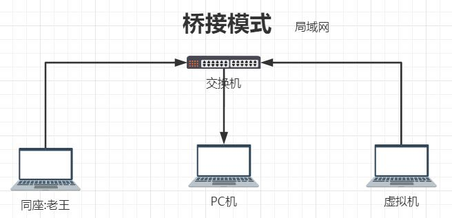

**②**NAT模式： 

&emsp;&emsp;&emsp;&emsp;类似于虚拟机通过NAT模式的网络地址转换功能，从而实现虚拟机与宿主机共享一个IP地址

> NAT模式虚拟出来的操作系统，通过转换与宿主机共享一个ip，能通过宿主机访问**公网**。

&emsp;&emsp;&emsp;&emsp;**特点**：NAT模式下，<u>在虚拟系统设置栏中手动分配</u>的静态ip与VMware8的ip子网ip在同一网段。

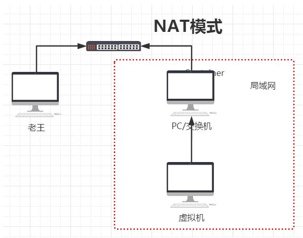

 

## 二、如何获得VMware8的ip

VMware虚拟机的虚拟网络配置

**①自定义VMware8的子网ip** （在自己定义的是网段为**122**，✨因为我此时连接的WiFi(局域网)的ip网段为122✨）

打开：  VMware软件中——>编辑 ——>虚拟网络编辑器——>更改设置——>

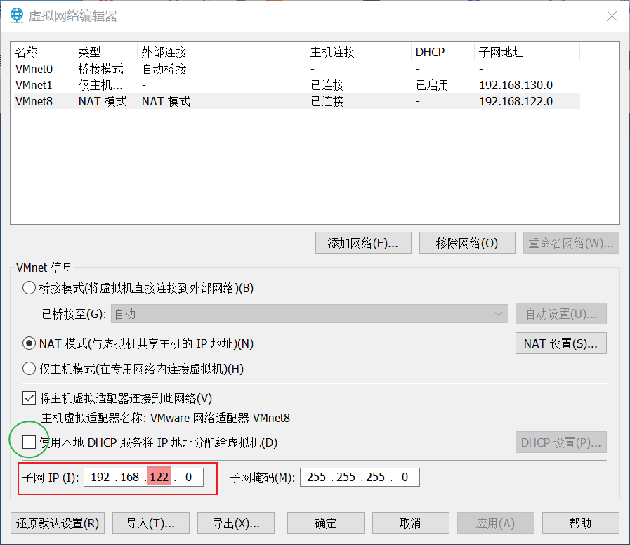

**②在电脑上为VMware8设置IPv4**（我自己设置的ip为：192.168.**122**.33）

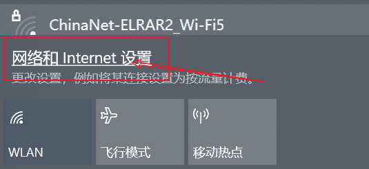

打开网络和Internet设置——>更改适配器选项——>选中VMnet8并右击属性——>选中Internet 协议版本 4(TCP/IPv4)并打钩——>属性——(进行下面的配置)

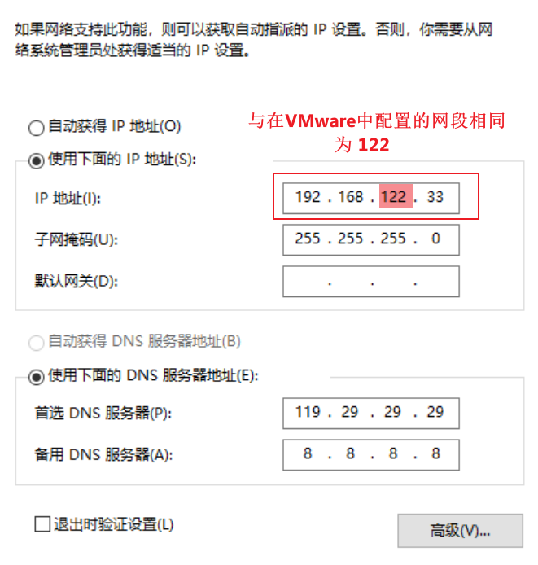

### 1、通过cmd命令查看

`ipconfig` 

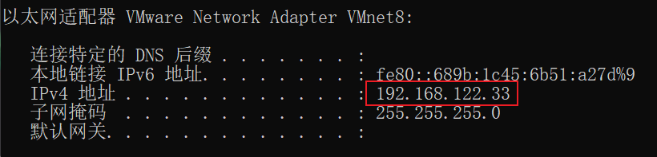

 

## 三、Centos搭建本地服务器

&emsp;&emsp;由前面的连接模式的介绍，可以发现，在NAT模式下搭建的虚拟机，<u>只有本地的宿主机可以访问的该虚拟系统</u> ，并且<u>可以访问外网（下载宝塔需要访问外网）</u>。显然，搭建本地服务器要所使用的是NAT模式 。

&emsp;&emsp;首先要安装VMware、Centos，安装过程自行解决（我常用自定义安装）。但安装过程要特别注意下面两点：

①模式要选择 **NAT模式**

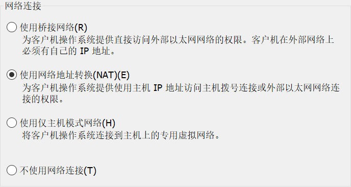

②root密码设置要牢记（后面要设置的用户和密码为开机密码）

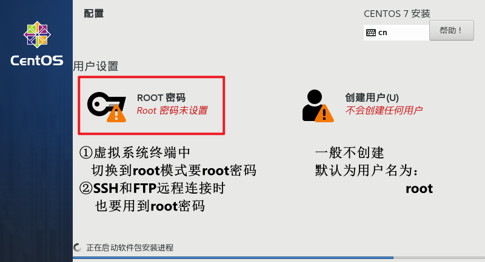

### 1、为Centos配置一个静态ip

**①自己定义一个ip地址**

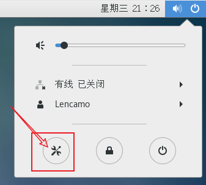

然后：——>网络——>有线设置按钮——>IPv4 ——>(手动设置)

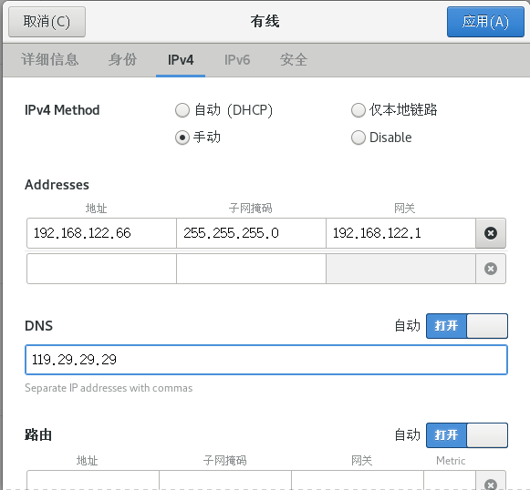

**②将自定义的ip设置为静态ip**

&emsp;&emsp;在安装好的Centos中鼠标右键——>打开终端；然后进行下面的操作

`su`

`vim /etc/sysconfig/network-scripts/ifcfg-ens33`

i    （进入编辑模式：开始编辑ifcfg-ens33文件）

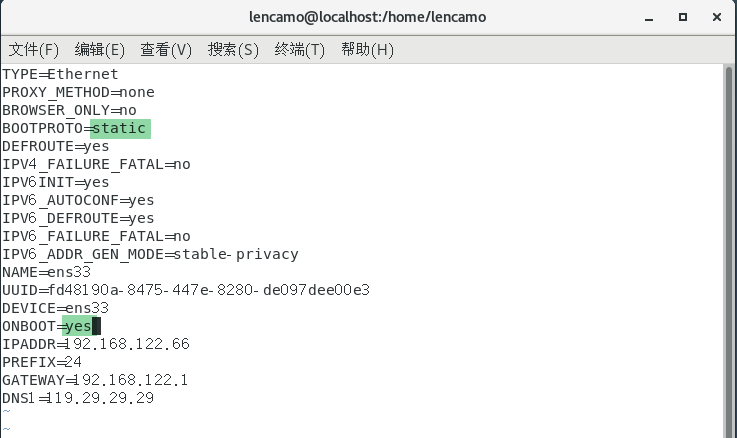

> 关于DNS服务器设置，我上面用的是国内腾讯云旗下的Public DNS+的免费DNS解析服务：119.29.29.29
>
> 当然国外也有许多免费的DNS解析服务，比如：谷歌的Google Public DNS：8.8.8.8
>
> 更多内容可以参考：https://www.techug.com/post/free-dns-server-ip-list.html

按下Esc键   （退出编辑模式）

:wq         （安全退出）

 

`systemctl restart network.service`    （重启服务）

 

## 三、结束语

&emsp;&emsp;自此，基于Centos搭建的web服务器已经完成。至于该服务器的使用，可以查看下面的几篇文章：

> 2、FTP文件传输、SSH远程登录
>
> 3、宝塔管理服务器

**&emsp;&emsp;重点信息：**

> ①没有设置root用户，默认用户名为root
>
> ②root密码
>
> ③搭建的Centos服务器地址192.168.122.66

 

## 四、友链

> 学习视频：https://www.bilibili.com/video/BV11a4y1Y7hu

