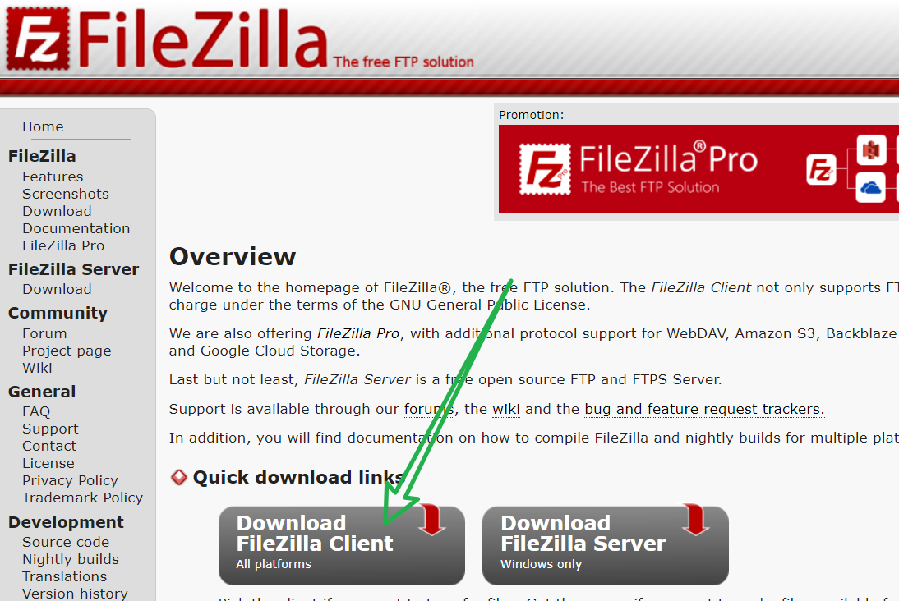
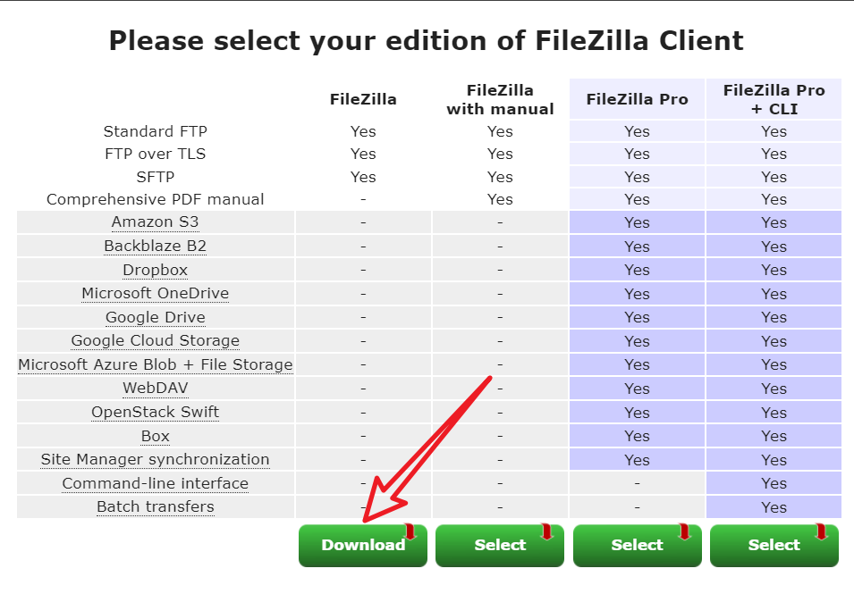
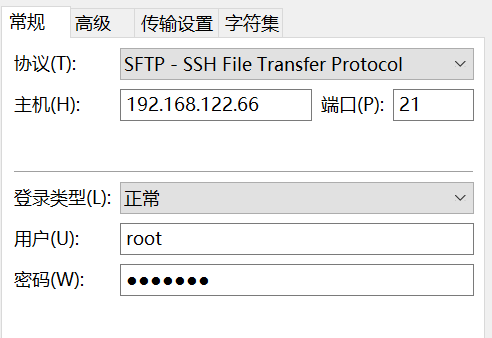
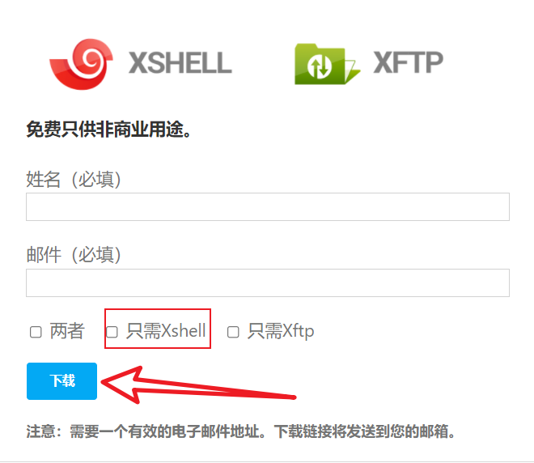
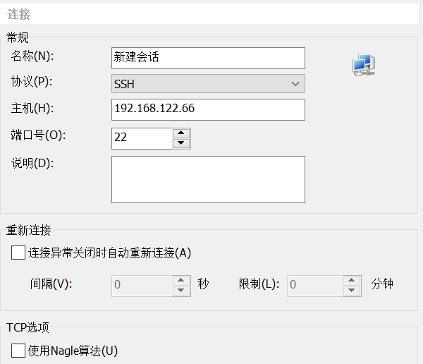

&emsp;&emsp;✨能使用FTP、SSH成功的前提是——服务器是处于开启状态✨

### 重点回顾（上篇文章）：

## 一、FTP文件远程传输

&emsp;&emsp;关于FTP远程传输的客户端有很多，比如： WinSCP、 FileZilla、SmartFTP等等，我常用的是免费的FileZilla。当然WinSCP也是不错的选择，很多学校教学都用的是WinSCP。

### 1、[下载安装](https://filezilla-project.org/) 

---

### 2、连接

> 文件 ——> 站点管理器 ——> 新建站点

&emsp;&emsp;以上篇文章《1.vm搭建本地web服务器》为例，这里连接Centos的方式为：

## 二、SSH远程登录

&emsp;&emsp;关于FTP远程传输的客户端也有很多，比如： Xshell、 SecureCRT、PuTTY等等，我常用的是个人用户免费版的Xshell，除此之外Xshell还有商业付费版。其实，SecureCRT口碑也不错，很多大佬用的都是它，但缺点是SecureCRT是收费软件。

### 1、[下载安装](https://www.netsarang.com/zh/free-for-home-school/)

### 2、使用

> 文件 ——> 新建 ——> 新建站点

&emsp;&emsp;以上篇文章《1.vm搭建本地web服务器》为例，这里连接Centos的方式为：

