&emsp;&emsp;eclipse与IDEA一样，是我们学习java路上的常用的开发软件，只不过学校常用的是eclipse罢了。

因此关于eclipse我就不做过多的介绍。

&emsp;&emsp;注意： 本人用的是**IDEA2021.2.2**

https://www.bilibili.com/video/BV1Sq4y1o7JR

## 一、项目整体认知

&emsp;&emsp;个人通常将自己的项目，分别放到自己建的**eclipse文件夹**或者**IDEA文件夹**中。

#### 1、比较

| eclipse中 |          | IDEA中  |
| :-------: | :------: | :-----: |
| workplace | 相当于—> | project |
|  project  | 相当于—> | module  |

#### 图解：

|                          eclipse中                           |        |                            IDEA中                            |
| :----------------------------------------------------------: | :----: | :----------------------------------------------------------: |
| 新建项目<span style="background-color: yellow;">workplace</span>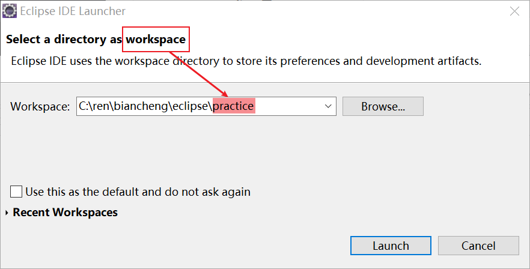 | 相当于 | 新建项目<span style="background-color: yellow;">project</span>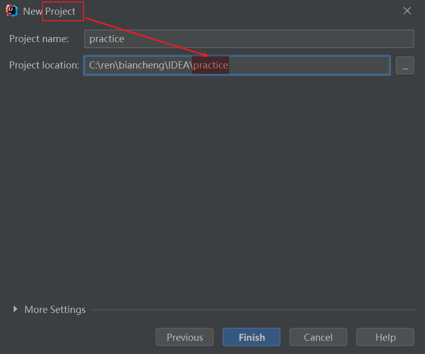 |
| 新建工程<span style="background-color: pink;">project</span>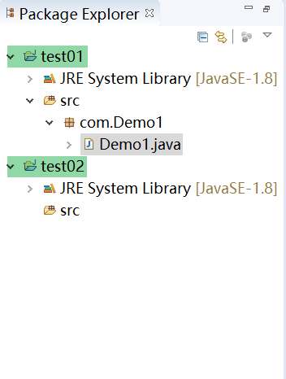 | 相当于 | 新建工程<span style="background-color: pink;">module</span>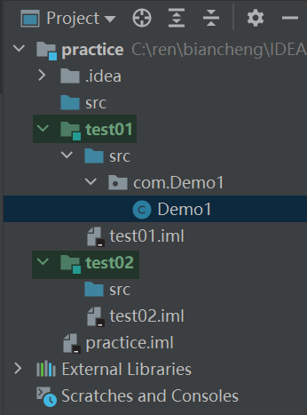 |


#### 2、out文件夹

新生成的out文件夹是用来存放.java文件编译后的字节码文件

#### 3、如何删除模块

先remove，然后才能delete


## 二、设置

> 要想使设置：
>
> &emsp;&emsp;先apple，然后再ok。

#### 1、更换主题、字体大小、字体颜色（我觉得原版的还行，就没瞎折腾）

略

#### 2、Ctrl + mouse滚轮  来改变字体大小✨

Setting——Editor——General——（*Mouse control*）

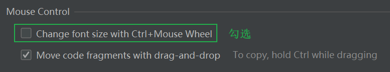


#### 3、自动import所使用的类/接口对应的库类java包  ✨

（手动导包快捷键：Alt + Enter）

Setting——Editor——General——Auto Import——（*java*）

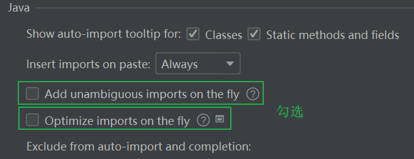

延展：关于合并为.\*，例`java.util.*`;

Setting——Editor——Code Editing——Java——

#### 4、鼠标悬浮与显示相关documentation

Setting——Editor——Code Editing——（*Quick Documentation*）

默认有

#### 5、忽略大小写，输入时仍然可以提示可能使用的相关属性✨

Setting——Editor——General——Code Completion——

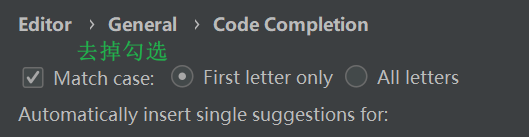

#### 6、项目或者作者基本信息声明文档File Header✨

Setting——Editor——File and Code Templates

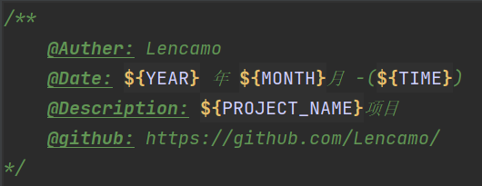


#### 7、行号

Setting——Editor——General——Appearance——

#### 8、文件的Tabs设置为可多行显示

Setting——Editor——General——Editor Tabs——（*Appearance*）

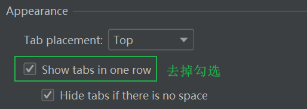

#### 9、设置项目的编码格式为UTF-8模式✨

Setting——Editor——File Encoding——

（把所以的Encoding选择为UTF-8即可）

#### 10、自动编译（更改时与out文件下的字节码文件同步）✨

Setting——Editor——Built，Execution，Deployment——Compile——

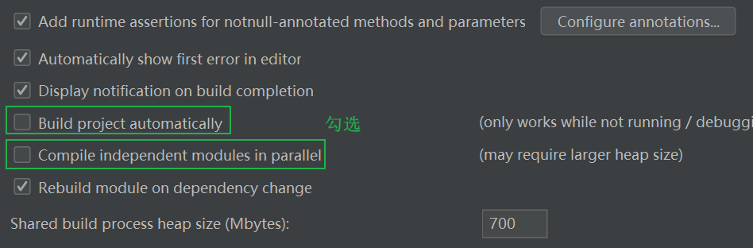

#### 11、其他

①分屏操作

略

②导入jar包💖

File——Project Setting——Libraries—— + ——Java——jar来源位置——选择要导入的module

③序列化版本号

略

④重命名

略


## 三、常用快捷键

#### 1、生成函数代码(构造方法、get/set方法、重写、equals/toString方法)/新建文件👍

`Alt + Insert`

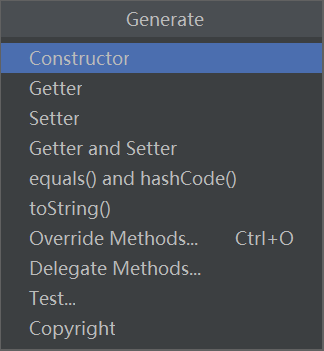

#### 2、创建对象自动生成变量/导包🍗

`Alt + Enter`

例： new int [4]&emsp;&emsp;创建数组对象

​         new String&emsp;&emsp;创建String类对象

（ &emsp;new Demo1      创建自建类对象  ）

更多用法：https://juejin.cn/post/6844903893478932494

#### 3、复制当前行或者选中的行到下面的一行

`Ctrl + d`

（常用于要输入/输出多个类似的语句时）

#### 4、将当前行上下移动

`Ctrl +  Shift +  ↑ / ↓`

#### 5、搜索

`Ctrl + n`

#### 6、注释

单行注释 `Ctrl + /`

多行注释 `Ctrl +  Shift +  /`

#### 10、缩进👏

向前 `table`

向后  `Shift +table`

#### 11、查看层层源码👍

手动方式： 选择 ——> Ctrl  ——> 点击

快捷键方式：`Ctrl + Alt + ↑ / ↓`


## 五、常用代码模板

&emsp;&emsp;打个比方，前面讲到的pswm、sout加回车，为IEDA默认有的代码模板

> ```
> public static void main(String[] args){
> 	System.out.println();
> }
> ```

&emsp;&emsp;位置：

>  Setting——Editor——General——postfix completion （默认不能改）
>
> Setting——Editor——Live Templates（能改，可自定义代码模板）


#### 1、main方法

psvm

#### 2、输出语句

sout

变量名.sout

其他:

①打印参数  outp

②打印方法名  outm

③打印变量   outv

#### 3、循环

**ⅰ.普通for循环**

fori

数组/集合名.fori   正向

数组/集合名.forr   逆向

**ⅱ.增强for循环（用于变量数组、集合）**

iter

.for

#### 4、属性修饰符

prsf  ：private static final

psf   public static final

#### 5、条件判断

①判断为空

ifn

变量名.ifn

②判断不为空

inn

变量名.inn


## 六、断点调试

#### 1、下一步按钮

①纯粹的下一步，不会进入任何方法

蓝色折线图标

②可以进入自定义方法，不可以进入系统类库方法(即查看源码方法：Ctrl + Alt + ↑/↓)

蓝色直线图标

③可以进入任何方法

红色直线图标

#### 2、断点间跳跃按钮

以断点的方式进行的下一步

略

