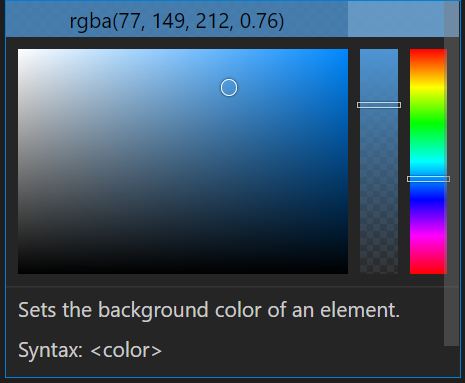
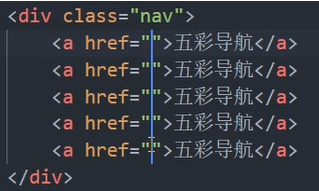
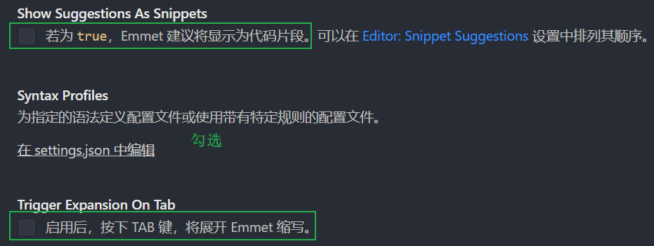
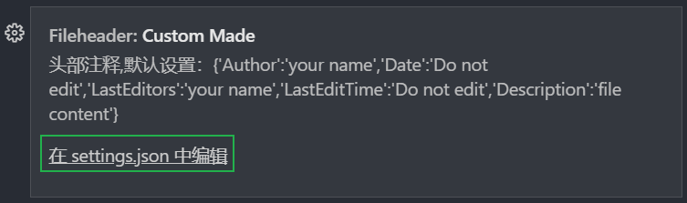
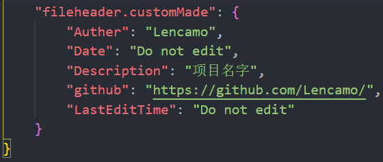
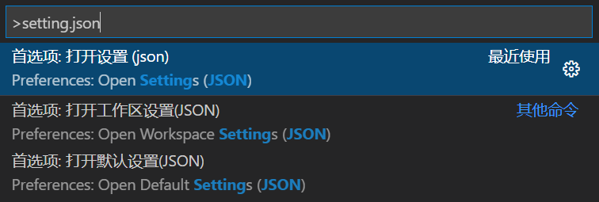
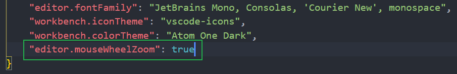

## 基础

### 1、打开终端

`Ctrl + \`

### 2、打开开发者模式(检查)

`Ctrl + Shift + I`

### 3、查找代码内容

`Ctrl + F`

https://www.bilibili.com/video/BV1Wh411U7R5

## 一、编辑器布局

查看——编辑器布局

## 二、git的分布式版本控制系统

### 1、位于vscode侧边栏

（可以实现类似于Sourcetree的操作）

### 2、可用gitlens插件管理

可以查看代码历史记录、查看branch及commit改动、

## 四、智能感知

css、html、json、php、

### 1、首字母感应💖

例如（更多的可以自己尝试）

`bg`：background

`bgc`：background-color

### 2、颜色感应

触碰时可自定义**透明度**



3、等等

## 五、Emmet语法💖

> Emmet语法官方文档：https://docs.emmet.io/cheat-sheet/

### 1、！+ Enter

HTML初始化

### 2、div<span style="background-color:pink;">*</span>n

> <!-- div*3 --> 
>
> ```html
> 	<div></div>
> 	<div></div>
> 	<div></div>
> ```

同类型兄弟间 相邻

### 3、div<span style="background-color:yellow;">></span>p

> <!-- div>p -->
>
> ```html
> 	<div>
> 		<p></p>
> 	</div>
> ```

父子包含

### 4、div<span style="background-color:green;">+</span>p

> <!-- div+p -->
>
> ```html
>     <div></div>
>     <p></p>
> ```

不同类型之间 相邻

### 5、div<span style="background-color:pink;">.</span><class_name>   /    <span style="background-color:red;">#</span><id_name>  ✨

> <!-- div.news -->
>
> ```html
> 	<div class="news"></div>
> ```
>
> <!-- div#news -->
>
> ```html
> 	<div id="news"></div>
> ```

快速生成带有名字的标签

### 6、同时选择上下多行的同一列内容



`Shift + Alt + 拖动要控制的行数`

### 示例：👀

> <!-- ul.header>(li>a.link)*5 -->
>
> ```html
>  <ul class="header">
>      <li><a href="" class="link"></a></li>
>      <li><a href="" class="link"></a></li>
>      <li><a href="" class="link"></a></li>
>      <li><a href="" class="link"></a></li>
>      <li><a href="" class="link"></a></li>
>  </ul>
> ```
>
> <br>
>
> <!-- div.search>div.logo{登录}+input[placeholder="keywords"] -->
>
> ```html
>  <div class="search">
>      <div class="logo">登录</div>
>      <input type="text" placeholder="keywords">
>  </div>
> ```
>
> <br>
>
> <!-- ul>li.content$*5 -->
>
> ```html
>     <ul>
>         <li class="content1"></li>
>         <li class="content2"></li>
>         <li class="content3"></li>
>         <li class="content4"></li>
>         <li class="content5"></li>
>     </ul>
> ```
>
> 

### 配置

在设置中搜索Emmet，然后勾选：




## 六、vscode插件

>  [vscode插件下载排行榜](https://marketplace.visualstudio.com/search?target=VSCode&category=All%20categories&sortBy=Installs)

### 1、通用插件

#### ①、Auto Rename Tag

&emsp;&emsp;对称标签前后自动同步修改

#### ②、Auto Close Tag

&emsp;&emsp;对称标签前后自动同步删除

#### ③、Prettier-Code formatter

&emsp;&emsp;保存时自动格式化代码

#### ④、Bracket Pair Colorizer 2

&emsp;&emsp;括号高亮

#### ④、Live Server

&emsp;&emsp;实时预览

#### ⑥、vscode-icons

&emsp;&emsp;文件图标样式

#### ⑦、Atom One Dark Theme

&emsp;&emsp;个人比较喜欢的主题（IDEA里面也可以下载该主题）

#### ⑧、koroFileHeader

&emsp;&emsp;项目或者作者基本信息声明文档File Heade

> **设置：**
>
> 在设置里搜索file header，然后





> **使用：**
>
> &emsp;&emsp;在需要File Header时，输入Ctrl + Alt + i 即可
>
> 使用该快捷键会自动在文件的最前面生成File Header信息

### 2、学习使用插件

#### HTML、CSS：

&emsp;&emsp;1.CSS Peek: 快速查看class和id对应的CSS代码

&emsp;&emsp;2.Icon Fonts: 字体图标库输入提示

&emsp;&emsp;3.HTML Boilerplate: HTML初始化兼容性模板

## 七、设置

#### 查看所有命令(搜索)

`Ctrl + Shift + P`

例： 更改settings.json文件



1、鼠标滚轮改变字体大小

选择上面的**Open Settings(JSON)**

在里面加入一行：

`"editor.mouseWheelZoom": true`


